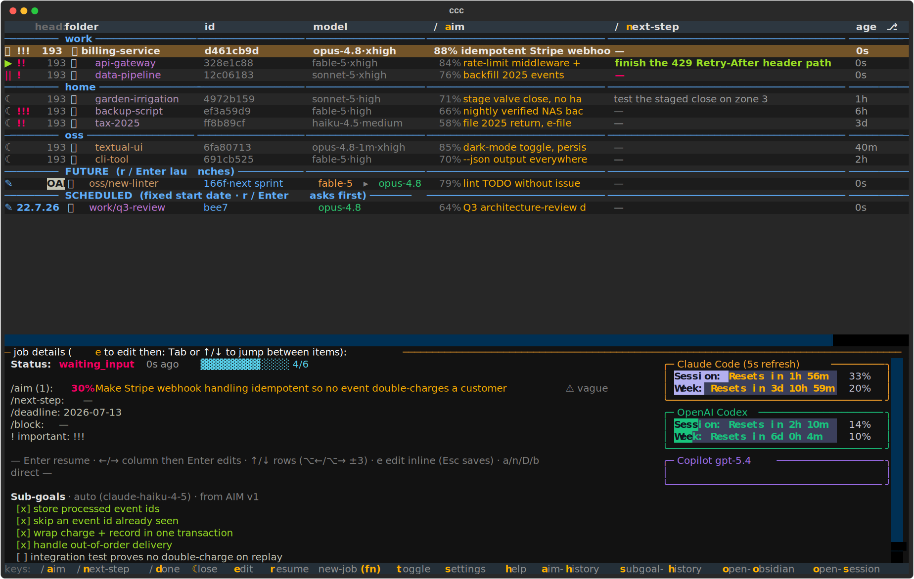

# ccc — a command center for your Claude Code sessions

You run a lot of Claude Code sessions. They pile up across projects, half-finished,
and you lose track of which one was doing what, how far it got, and what it was
waiting on. **`ccc`** is a command center that keeps all of them in one view: every
session is visually distinguishable, grouped by **your own categories** (work / home /
oss …), each carrying a stated **AIM** — the one-line done-condition — and a live
**progress bar**. Have an idea you can't act on right now? Park it as a **future
job** and start it later — from the terminal or by tapping ▶ in an Obsidian note,
even from your phone.



## The two ideas that make it work

**1. Give every session an AIM.** An AIM is a few words that define *"this session
is done when: …"*. It sounds trivial; it changes how you work. `ccc` scores every AIM
for concreteness (a vague AIM gets flagged red and the session sharpens it
**automatically from context** — grounded in the files it actually edits and the task
in progress, verified by an independent scorer), tracks progress against it as a
checklist bar, and — with the optional checkers
on — an impartial second model grades whether the goal is actually *met*. You stop
asking "what was this session even for?" because the session already told you.

**2. Write ideas down as future jobs.** The moment you think *"I should do X in repo
Y"*, you don't have to open a session and lose your current train of thought. You save
a **future job**: an AIM, a repo, and (optionally) a fuller prompt. It sits in a
`FUTURE` list until you start it — from `ccc`, from a terminal, or by tapping a button
in an Obsidian note. This externalizes memory, queues work for later, and routes
around session/rate limits: describe now, run when there's capacity.


*A parked future job in Obsidian — ▶ starts it in a new terminal tab.*

A job can also declare it **depends on** another job finishing first
(`ccc new-job -d <id-or-hash>`, or the `/depends-on` row in the TUI `e` editor). A row
whose dependency isn't done yet wears a red `|-->` marker and, when its dependency is
visible, hoists directly under it in the TUI and `ccc ls`; every launch path (CLI, TUI,
the Obsidian `launch: true` toggle) warns before starting a still-blocked job. See
[Dependent jobs](docs/reference.md#dependent-jobs) for the full behaviour.

Everything else — the progress bars, the drift checker, the vault mirrors, auto-resume
— falls out of taking those two ideas seriously.

## Quickstart (5 minutes)

```commands
# 1. install the `ccc` CLI on PATH
uv tool install git+https://github.com/glensk/ccc

# 2. see it immediately — no wiring, fake data, throwaway store
ccc demo            # opens the TUI against ~10 demo sessions
ccc demo --ls       # or the flat list; `ccc demo --clean` removes the demo dir

# 3. set it up for real (interactive wizard: env check → consent → installers)
ccc init

# 4. start sessions with `c` (the shell wrapper `ccc init` offers, recommended-yes)
c                   # asks "AIM of this session (empty to skip):", then launches claude
ccc                 # the interactive TUI (flat list when piped)
ccc ls              # a scripting-friendly flat list of every tracked session
```

The intended default flow is the **shell integration** `ccc init` offers (and
recommends): a wrapper named `c` that, before it launches `claude`, asks
`AIM of this session (empty to skip):` and seeds the session with that
done-condition — so every session starts already knowing what it's for, shows up in
`ccc` with that AIM, and gets a live progress bar and status line. You can also set or
refine the AIM from inside a running session with `/aim`. Opting out is trivial: answer
no in `ccc init`, remove the wrapper later with `ccc install-shell --uninstall`, or
just run `claude` directly.

> **A fresh install does nothing until you ask it to.** Out of the box `ccc` spends
> **no** LLM tokens, makes **no** network calls, auto-closes **nothing**, and writes
> **only** under `CLAUDE_HOME`. Every token/network/vault/reap feature is opt-in —
> `ccc init` presents them as a consent checklist. `ccc demo` is completely
> self-contained and safe to run on any machine.

## What you get

Core tracking and the TUI work anywhere Python does. The richer features are opt-in
and some are macOS-first (they drive iTerm2 / Karabiner). Honest table:

| Feature                       | What it gives you                                                                            | Requires                                                           | Enable                               |
| :---------------------------- | :------------------------------------------------------------------------------------------- | :----------------------------------------------------------------- | :----------------------------------- |
| Core tracking                 | AIM, progress, next-step, deadline, blocked-on per session                                   | Python only                                                        | always on                            |
| Textual TUI (`ccc`)           | arrow-key UI: cards, bars, category grouping, resume-in-new-tab                              | `textual`                                                          | always on                            |
| Browser UI (`ccc serve`)      | the same TUI served to `localhost` (ships, but the author has not used it day-to-day so far) | `textual-serve`                                                    | `ccc serve`                          |
| Hooks + status line           | `/aim` seeding, live progress in the status line, live todos                                 | Claude Code hooks                                                  | `ccc init` / `ccc install-hooks`     |
| AIM concreteness score        | flags a vague AIM red; the session auto-sharpens it, verified by an independent scorer       | pluggable ladder: Copilot (opencode) / gemini-cli / codex / claude | `aim_score_on_set`                   |
| Sub-goal auto-derive + grade  | auto-builds + ticks the checklist so the bar moves on its own                                | a cheap LLM (Haiku)                                                | `autoprogress` / `grade_on_turn`     |
| Drift + DONE checkers         | impartial second model grades goal-drift and "is the AIM met?"                               | a cheap LLM (Haiku)                                                | `drift_check` / `assess_aim_on_turn` |
| Future jobs                   | park a described job, launch it later from terminal or Obsidian                              | Python only                                                        | always on                            |
| Obsidian mirrors + dashboards | every session as a searchable markdown note; job-launch buttons                              | an Obsidian vault                                                  | `ccc obsidian-setup`, mirror flags   |
| Background daemon + alerts    | reaps idle sessions, regenerates summaries, desktop-notifies                                 | launchd (macOS) / systemd --user (Linux); `notify-send` on Linux   | `ccc daemon --install`               |
| Auto-resume halted            | resumes rate-limit-halted sessions once the limit resets (machine must stay on)              | `claude-session-continue`                                          | `resume_halted`                      |
| Cross-session file locks      | serializes edits when several sessions share one checkout                                    | Claude Code hooks                                                  | `file_lock_enabled` (default on)     |
| Codex delegation              | hand implementation to OpenAI Codex; Claude only verifies                                    | `codex` CLI                                                        | `-j codex` jobs / slash command      |
| Copilot usage card            | month-to-date GitHub Copilot spend in the TUI                                                | `gh` CLI + a Copilot seat                                          | `copilot_usage`                      |
| Peek + jump *(macOS)*         | float a panel of a tab's prompts/AIM; one-key toggle to/from `ccc`                           | macOS + iTerm2 + Karabiner                                         | Karabiner chords                     |

*LLM-checker cost note:* the checkers run on a cheap model (Haiku by default) and are
bounded (one call per turn, debounced, capped per daemon pass). You choose the model,
and the provider is pluggable.

## Underplayed killers

A few features that don't fit in a one-liner but are the reason people keep it running:

- **Auto-resume after a rate-limit reset.** When an account hits its session/weekly
  limit, its tracked sessions go `|| halted`. Turn on `resume_halted` and a watcher
  resumes them the moment that limit clears — staggered across repos, serial within a
  repo, so nothing thundering-herds and no two resumes edit one checkout at once. Each
  account has its **own** reset gate and each session is revived **on the seat it was
  started from** (a `work` session comes back on `work`), so one account's limit never
  holds back another's. A halt that ccc will revive shows a green `▶` after the red
  `||` (`||▶`); a bare `||` means it is stranded until you resume it yourself.
- **Impartial drift + DONE checkers with published rubrics.** A long-running agent that
  sharpens its own AIM and re-derives its own sub-goals can quietly move the goalposts.
  A **separate** model — never the session agent, fed only the goals and the evidence —
  grades goal-drift and whether the AIM is genuinely met, against a fixed, published
  rubric. A confirmed drift shows a blue `●`; a met AIM shows a red `DONE` stamped
  inside the bar.
- **Cross-session file locks.** Several sessions in one working tree editing the same
  file interleave their changes into one ambiguous blob. An advisory per-file lock (via
  hooks) serializes writes, with an agent-judged hand-off that commits before releasing.
- **Full-session markdown mirrors.** Every session — running, parked, or done — is
  mirrored to a markdown note in your Obsidian vault: the whole conversation, prompts,
  AIM history, sub-goals, rendered terminal-like. Your entire Claude Code history
  becomes searchable, linkable, and phone-readable.
- **The peek panel.** Hold a key, and a floating panel shows every prompt you've typed
  in the focused tab (plus its AIM history) — so *"what have I been asking here?"* is
  one keystroke, not a scroll through the transcript.

## Commands

`ccc --help` lists every command, and the full command reference — every flag, the TUI
keys, the future-job files, the daemon — lives in
[docs/reference.md](docs/reference.md). The two worth knowing on day one are `ccc demo`
(the zero-setup, fake-data command center) and `ccc doctor` (a read-only health check of
your install and environment). Inside a Claude Code session, the slash commands `/aim`
`/next-step` `/done` `/block` `/deadline` (installed by `ccc init`) drive the same
actions from the prompt, and the `ccc-mark-done-and-close` skill (shipped by default)
lets you say "mark this session as done" to finish AND close the session — its terminal
pane/tab closes itself after the turn. For automations that just changed ccc's own code or config (an
editable install), `ccc restart-tui` bounces the running TUI in its **own** terminal tab
so the new code loads — no manual keystroke; it exits 0 once the TUI is back, 1 if none
is running.

In the TUI, the `t` leader chord shows/hides the usage cards: `t1`…`t4` for the
Claude/Codex/Copilot subscription cards, and `to`/`ta` for two optional cards fed by an
*external* homelab "overseer" alert-triage daemon (incidents awaiting you + recent
automatic activity) — off until you set `nixos_overseer_dir` in `config.toml`. And `u`
undoes the last action — a close/park, mark-done, Keep, importance, sub-goal tick,
account switch, or any toggle — walking back up to 20 steps per run. See
[docs/reference.md](docs/reference.md).

## Platform support

- **macOS is the first-class target**, with **iTerm2** recommended — resume-in-new-tab,
  tab badges, the peek panel and the jump chord all drive iTerm2 (and Karabiner for the
  global chords).
- **Terminal.app / other terminals**: core tracking, `ccc ls`, the TUI and the daemon
  all work; `ccc install-shell` adds cross-terminal OSC tab badges; the iTerm-specific
  launch/peek/jump niceties do not.
- **Linux (Ubuntu) is a supported core path**, not an afterthought — a plain terminal
  runs the store, CLI, the TUI, the Claude Code hooks, the checkers and the pluggable
  score ladder, future jobs, `ccc obsidian-setup`, `notify-send` desktop alerts, OSC tab
  badges (`ccc install-shell`) and a **systemd --user** daemon. Job launch and
  resume-in-a-new-window use **tmux** (`launcher = "tmux"`, recommended). The peek
  floating panel and the `jump` chord (and iTerm tab colors) stay macOS-only. See
  **[docs/linux.md](docs/linux.md)** for the Ubuntu quickstart.

## Mobile access (GrapheneOS)

ccc's sessions run on an always-on Mac/Linux host; the phone is a **remote control**, not
a second install. Three complementary channels — all verified on a de-Googled
[GrapheneOS](https://grapheneos.org) Pixel, none of them Android-specific:

1. **The Claude mobile app + a `remote-control` server (no terminal at all).** Run
   `claude remote-control --spawn same-dir --name <host-name>` (e.g. `mac-42git`) on the
   host, inside tmux
   (or a login agent) so it survives reboots, with your repos' parent directory as its
   working dir. It registers with your claude.ai account and appears in the app's
   **Code tab** under that name — open it, type a task ("in `<category>/<repo>`, fix X"),
   and it **spawns a fresh Claude Code session on the host on demand**. Every session it
   spawns shows up in `ccc ls`/the TUI like any other, and every session you start in a
   terminal shows up in the app, so you can start at the desk and steer from the couch.
   Caveats: the app can't answer permission prompts (pick your permission mode
   accordingly), and it only spawns under the server's root — anything else is channel 2.
2. **Termux + SSH + tmux (the full-control channel).** A private overlay network
   (WireGuard or similar) plus `ssh <host>` from [Termux](https://termux.dev) attaches
   the host's persistent tmux session: the full `ccc` TUI renders fine on a phone
   terminal (truecolor works), `r` resumes a parked session into a new tmux window
   (`launcher = "tmux"`), and a dropped connection loses nothing — reconnect and tmux is
   exactly where you left it. `ccc serve` offers the same TUI in the phone browser as an
   even lighter client.
3. **Obsidian mobile (read + queue + launch, zero terminal).** With the vault mirrors on,
   every session is a synced note; a future-job file's `launch:` checkbox is a one-tap
   "start this on the host" button — see [docs/obsidian.md](docs/obsidian.md).

As a fallback for when the host is unreachable, Claude Code itself runs on the phone
inside a Termux **proot** Linux userland (unofficial but workable: official installer,
autoupdater disabled, `ccc` with `launcher = "tmux"`). Background, principles and the
full phone story: [docs/roadmap-mobile-grapheneos.md](docs/roadmap-mobile-grapheneos.md).

## Tech stack

- **Python 3.11+, stdlib-first** — a handful of runtime deps (`textual`, `textual-serve`,
  `pyyaml`, and `pyobjc` on macOS only), so `uv tool install` is quick and the surface
  area stays small.
- **[Textual](https://textual.textualize.io/)** drives the TUI; the *same* UI is served
  to the browser by `ccc serve` (`textual-serve`) with no separate frontend.
- **SQLite is the single source of truth** — a WAL store under
  `CLAUDE_HOME/command-center/`; no server or running daemon is needed to read it.
- **Claude Code integration is transcript-first** — ccc reads Claude Code's own hooks and
  status-line JSON plus its on-disk transcripts. It never wraps or proxies the model API;
  the transcript is the source of truth.
- **Pluggable, multi-provider LLM ladder** for the cheap checkers (AIM score, drift, DONE,
  short-AIM): Copilot / gemini / codex / claude, first working rung wins, with a `custom`
  shell-command escape hatch. Anthropic is the default, not a hard dependency.
- **Packaging is `uv` + `hatchling`** — the Obsidian templates, Linux hotkey samples and
  the pinned plugin manifest ship as package data inside the wheel.
- **Optional Obsidian layer** (Dataview / Meta Bind / Shell commands) turns future jobs and
  sessions into editable, searchable notes.
- **Platform glue**: macOS uses AppleScript + PyObjC (iTerm tabs, the peek panel); Linux
  uses the equivalents — **systemd** user units, **`notify-send`**, and **OSC** terminal
  tab badges.

## Docs

- [docs/reference.md](docs/reference.md) — the full feature reference (TUI keys, peek/jump,
  future-job files, mirrors, locks, daemon, resume-halted, AIM scoring/drift/DONE internals).
- [docs/hooks.md](docs/hooks.md) — what each installed hook does, the status line, the
  Stop-hook ordering contract.
- [docs/obsidian.md](docs/obsidian.md) — the Obsidian integration: dashboards, job-file
  buttons, the phone-friendly `launch:` toggle, troubleshooting.
- [docs/codex.md](docs/codex.md) — delegating implementation to OpenAI Codex.
- [docs/linux.md](docs/linux.md) — the Ubuntu quickstart: what works out of the box, the
  systemd daemon, `notify-send`, tmux job launch, and the keyd/xremap hotkey samples.
- [docs/roadmap-mobile-grapheneos.md](docs/roadmap-mobile-grapheneos.md) — following and
  starting jobs from a phone.

The TUI screenshot above is regenerated from the `ccc demo` data with
`tools/gen_screenshots.py`; a terminal GIF renders from `docs/demo.tape` with
[vhs](https://github.com/charmbracelet/vhs) (`vhs docs/demo.tape`). The Obsidian figure
is a captured `ccc obsidian-setup` demo vault.

## License

Apache-2.0 — see [LICENSE](LICENSE).
