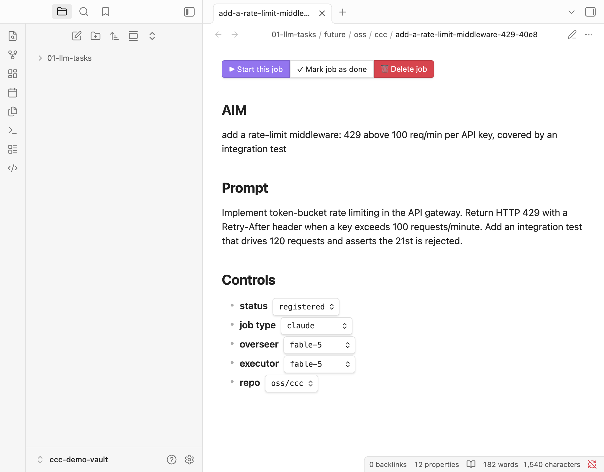

# ccc + Obsidian

`ccc` can mirror your whole session lifecycle into an [Obsidian](https://obsidian.md)
vault: future jobs you can launch from a note, read-only mirrors of every running and
done session, and full-conversation notes you can search. Everything is driven by
`ccc obsidian-setup` and the vault-mirror config flags.

This integration is entirely opt-in. With no vault configured, `ccc` never touches disk
outside `CLAUDE_HOME`.

## One-time setup

```commands
ccc obsidian-setup [-r VAULT] [--install-plugins] [-n] [-u]
```

`obsidian-setup` is **content-only and offline by default**. It:

- creates the ccc task folders under your vault (`01-llm-tasks/{future,delete,running,done,sessions}`
  plus the capture pad `new-prompt.md`) — the exact paths come from your config, not
  hard-coded;
- renders the dashboards (below) from templates, substituting your folder paths and the
  absolute `ccc` binary; generated files carry a `ccc_generated` marker so reruns and
  `-u/--uninstall` only ever touch ccc's own files;
- merges the four `obsidian-shellcommands` entries the in-note job buttons fire.

`-n/--dry-run` shows what would change; `-u/--uninstall` removes the ccc-generated
dashboards and entries.

### Required community plugins

The job buttons and dashboards need three community plugins:

| Plugin                    | Used for                                                          |
| :------------------------ | :--------------------------------------------------------------- |
| **Meta Bind**             | the inline `▶ / ✓ / 🗑` buttons and the labelled `## Controls` dropdowns |
| **Obsidian Shell Commands** | the commands those buttons run (`ccc open-job` / `done-job` / …)  |
| **Dataview**              | the `future` / `running` / `parked` / `delete` dashboards (dataviewjs) |

Install them yourself, or let ccc bootstrap them: `ccc obsidian-setup --install-plugins`
is the **only networked path** — it is consent-gated and each download is sha256-verified
against a pinned manifest. After it runs, reload Obsidian so the plugins load.

> **Meta Bind is pinned to 1.4.1**, not the latest 1.5.1: 1.5.1's `manifest.json` declares
> `minAppVersion 1.13.1`, but the current Obsidian release line is 1.12.x — installing 1.5.1
> there never registers and the job buttons render as raw code. 1.4.1 (`minAppVersion 1.4.0`)
> renders the real ▶/✓/🗑 row. Repin to 1.5.1 once Obsidian 1.13+ is widespread.

## Future-job files

Every future job (draft) is mirrored to one editable markdown file under
`01-llm-tasks/future/<category>/<repo>/<slug>-<hash>.md`. The file is the source of
truth you can edit by hand — the sync reconciles file edits back into ccc (file wins) and
exports ccc-side changes to the file, atomically and idempotently.

Each job file carries an in-note **button row** (rendered by Meta Bind), above the AIM,
prompt and `## Controls` dropdowns:



| Button              | Runs                          | Effect                                                        |
| :------------------ | :---------------------------- | :----------------------------------------------------------- |
| **▶ Start this job** | `ccc open-job --file <path>`  | launches the job in a new terminal tab (AIM pre-set)         |
| **✓ Mark job as done** | `ccc done-job --file <path>` | marks it done *without* running it; it joins the DONE list   |
| **🗑 Delete job**    | `ccc delete-job --file <path>` | soft-deletes to the vault trash (restorable)                 |
| **↩ Stage job back in** | `ccc restore-job --file <path>` | (in the trash) un-deletes it back into FUTURE            |

Below the prompt, a `## Controls` section holds labelled Meta Bind dropdowns — **status**,
**job type**, **overseer** / **executor** model, and **repo** — because Obsidian's native
Properties panel can only *suggest* values, not offer a fixed option list.

### Launch from your phone: the `launch:` checkbox

Every job file has a bare-boolean frontmatter key `launch: false`. On mobile — where the
Shell-Commands buttons are dead — Obsidian renders it as a one-tap **checkbox** in the
properties UI. Flip it to `true`, and the next sync pass consumes the flag and launches
the job (in an iTerm tab, or a tmux window when scripting isn't available, e.g. under the
launchd watcher). The file is reset to `launch: false` *before* the launch spawns, so a
failed spawn never re-triggers. This is the phone-flip → sync-daemon → launch chain.

On the **capture pad**, ticking `launch` is enough by itself: a `draft` pad with the
toggle on is treated as `ready` and registers **and** launches in one pass — no status
edit needed (the mobile Properties `status` field is free text, and `ready` never
persists anywhere, so its suggestions can't offer the one value that matters). A pad
flipped to `status: error` by a failed validation stays skipped until you reset its
status, even with `launch` still ticked.

## Whole-lifecycle mirrors

With the mirror flags on, every tracked session becomes a markdown note (export-only —
ccc owns them, your edits are overwritten):

| Tree                         | Flag              | Contents                                                    |
| :--------------------------- | :---------------- | :---------------------------------------------------------- |
| `01-llm-tasks/running/`      | `mirror_running`  | one note per active session (AIM, sub-goals, next step, prompts) |
| `01-llm-tasks/done/`         | `mirror_done`     | the final snapshot of every finished session                |
| `01-llm-tasks/sessions/`     | `mirror_sessions` | the **whole conversation** rendered terminal-like, per session |

The mirrors are byte-stable (rewritten only on a real change) and slugged from the
session's *first* AIM so filenames never churn when the AIM is sharpened. Each
running/done note links to its stable full-session note (a `session` frontmatter chip and
a `[[…|full session]]` wikilink), so your entire Claude Code history is searchable and
cross-linked in Obsidian — and readable on your phone.

## Dashboards

Three dataviewjs dashboards sit one level above the mirror trees (so they never mirror
themselves):

- **`01-llm-tasks/future.md`** — editable: native dropdowns write frontmatter, ▶ launches
  a job via `ccc open-job`.
- **`01-llm-tasks/running.md`** — read-only over the running tree; ⤢ focuses a live tab via
  `ccc focus-job`.
- **`01-llm-tasks/parked.md`** — the running tree filtered to closed-but-unfinished (`☾`)
  sessions; ▶ resumes one in a new tab via `ccc resume-job`.

The trash has its own `01-llm-tasks/delete/delete.md` with an ↩ restore column.

## Troubleshooting

**A button reads "Button ID not Found."** Meta Bind keys its button registry by file
path, with refcounted register/unregister per render. If a job file is renamed or moved
**while its tab is open**, the inline `BUTTON[…]` row can look the buttons up under a
different path than the hidden definitions registered under — all three chips then read
"Button ID not Found" even though the file is correct. **Fix: close and reopen the note,
or reload Obsidian (Cmd/Ctrl+R).** Nothing is wrong with the file or with ccc; verify with
`ccc sync-future -v` (expect `errors=0`) if in doubt.

**Verifying a dashboard renders (for agents/automation).** Obsidian normally runs without
a debugging port. Relaunch it with the Chrome DevTools Protocol enabled and drive it with
Playwright:

```commands
osascript -e 'quit app "Obsidian"'            # wait for exit, then:
open -a Obsidian --args --remote-debugging-port=9223
curl -s http://localhost:9223/json/version    # sanity: Obsidian answers over CDP
```

Then `connect_over_cdp("http://localhost:9223")`, find the page where
`typeof app !== 'undefined' && !!app.workspace`, run
`app.workspace.openLinkText('<vault-relative-note>', '', false)`, wait for dataviewjs to
render, and screenshot. The flag does not persist across a normal relaunch. (Dataviewjs
blocks eval as a *Program*, so the dashboards wrap their body in an async IIFE.)
