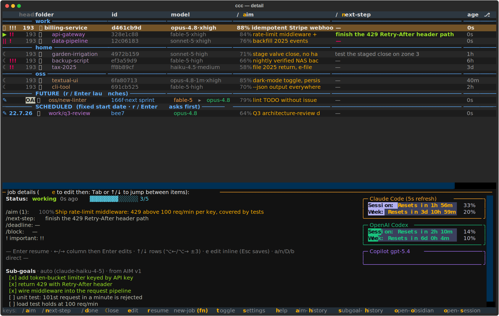

# ccc — full reference

The complete feature reference for `ccc`, the command center for your Claude Code
sessions. For the pitch and 5-minute quickstart see the [README](../README.md). The
Obsidian, hooks, Codex and mobile guides live alongside this file:
[obsidian.md](obsidian.md) · [hooks.md](hooks.md) · [codex.md](codex.md) ·
[roadmap-mobile-grapheneos.md](roadmap-mobile-grapheneos.md).

Throughout, `repo_root` is the root of your category/repo tree (the `repo_root` config
key, or `$GIT_BASE`); sessions are grouped by the first folder beneath it (e.g.
`work` / `home` / `oss`).

### Commands — the full catalogue

`ccc --help` prints the whole catalogue; `ccc <cmd> --help` documents each command's
flags. Grouped by what they do:

**The command center**

- `ccc` / `ccc tui` — the interactive Textual TUI (falls back to the flat list when piped).
- `ccc ls` — a flat, clickable, one-line-per-session list (scripting-friendly).
- `ccc demo [--ls] [--clean]` — a throwaway fake-data command center; safe to try with zero setup.
- `ccc serve [--host --port]` — serve the TUI in the browser (`textual-serve`).
- `ccc doctor` — read-only health check of the install + environment (exit 1 on any ❌).
- `ccc init` — first-run wizard: environment check → consent → installers.

**AIM, progress & the checkers**

- `ccc set-aim "<done-when>"` — set the done-condition (the single chokepoint for CLI/TUI/hook).
- `ccc aim` · `ccc aim-history` — the current AIM / its first→current progression.
- `ccc set-next` · `ccc set-blocked` · `ccc set-deadline` · `ccc set-donecheck` — the other job fields.
- `ccc subgoals "step" …` (`--list`, `--adaptive`, `--merge`) — the progress checklist.
- `ccc check <N>` (`--uncheck`) · `ccc subgoal-check <N> "<cmd>"` — tick an item / attach a shell predicate.
- `ccc mark-done` (`--undo`) · `ccc keep` (`--off`) — finish / exempt a session from the idle reaper.
- `ccc todos` — a session's live TodoWrite/Task list; `ccc ack-drift` — acknowledge a flagged drift.
- `ccc subgoal-history` — the checklist's evolution + drift verdicts.
- Internal LLM checkers, spawned automatically (rarely run by hand): `ccc score-aim`, `ccc short-aim`, `ccc check-drift`, `ccc assess-aim`, `ccc autoprogress`.

**Future jobs**

- `ccc new-job -a "AIM" [-p PROMPT] [-c REPO] [-s YYYY-MM-DD] [-d DEP] [-j codex] [-O overseer] [-E executor]` — park a future job (`-d` = another job it depends on).
- `ccc new-prompt [-r cat/repo] [-o]` — a prefilled capture file for a future job.
- `ccc jobs` — list registered future jobs (drafts).
- `ccc job-account` — per-account usage urgency + which account a new job will bill to (the `job_account` policy).
- `ccc start-job <id>` / `ccc open-job <id>|--file` — launch a saved job (in place / in a new tab, safe from Obsidian).
- `ccc done-job` · `ccc delete-job` · `ccc restore-job` · `ccc unlaunch` — the lifecycle: done-without-running / trash / restore / back-to-draft.

**Sessions & tabs**

- `ccc resume <id>` — resume a session in this terminal (`execvp`).
- `ccc resume-job <id>` — resume a parked session in a new tab (focuses it if already live).
- `ccc focus-job <id>` — bring a live session's tab forward (verifies it is live first).
- `ccc rm` · `ccc prune` — drop a tracked row / delete contentless `claude -p` leftovers.
- `ccc peek` (`--print`) · `ccc jump` — the macOS peek panel / the ccc↔session toggle.

**Obsidian & mirrors**

- `ccc obsidian-setup [-r VAULT] [--install-plugins]` — seed the vault folders, dashboards & job buttons.
- `ccc sync-future` · `ccc sync-mirrors` — reconcile the future-job files / export the running+done mirrors (usually automatic).

**Cross-session file locks**

- `ccc handoff <file>` — commit+push a locked file, then release it for a waiting session.
- `ccc locks` · `ccc lock-release <file>` — list / force-release active locks.

**Install & housekeeping**

- `ccc install-hooks` · `ccc install-statusline` · `ccc install-commands` · `ccc install-shell` — the individual installers `ccc init` runs.
- `ccc daemon [--install|--uninstall|--status|--dry-run]` — the background housekeeper (launchd on macOS, systemd `--user` on Linux).
- `ccc resume-halted [--watch|--dry-run]` — auto-resume rate-limit-halted sessions once the limit resets.
- `ccc toggle-idle` · `ccc tab-symbol` · `ccc tag` · `ccc copilot-usage` — mute idle popups / per-repo badge / typed @tags / refresh Copilot usage.

Inside a Claude Code session the slash commands `/aim` `/next-step` `/done` `/block`
`/deadline` (plus `/aim-history`, `/subgoal-history`) drive the same actions from the
prompt; they are installed by `ccc init` / `ccc install-commands`.

### Peek — "what have I asked here?" (`ccc peek`)

`ccc peek` resolves the iTerm tab you are looking at to the Claude session running
in it and shows a floating macOS panel titled **"ccc peek panel"** (so you can refer to
it by name). A **header** mirrors the Claude Code status
line so the panel is unambiguously "this tab": the tab's coloured emoji **badge**
(💙 / 🔵 / …), the **session id** painted on its tab-colour background (the same
colour the status line uses — the per-tab `iterm-tab-rgb` cache, repo colour as
fallback), and the **working directory**. Below it are **three tabs**:

- **prompts** — every *human* prompt of the session, oldest `(1)` at the top down to
  the most recent at the bottom (the view opens scrolled to the bottom), in a
  permanently-scrollable pane. Each prompt is headed by a `(N) ───…` **rule line**
  (number + separator on one line, in a distinct blue) followed by a blank line; the
  **newest prompt renders pronounced in bold gold** so the current ask always stands
  out. Background-task completion
  notices (the `<task-notification>` blocks the harness injects as user records) are
  **not** prompts and are filtered out — the list is what *you* typed only.
- **session** — the **full conversation**, terminal-like: each `## (N) you` prompt
  (numbering matches the prompts tab), Claude's replies, and dim `⏺ Tool(input…)` /
  `⎿ result…` one-liners for every tool call (results truncated to a few lines; no
  thinking blocks, no full tool outputs). It is the SAME canonical render the vault
  **session mirror** file embeds (`command_center/sessionmd.py` is the single
  source), capped at 512 KiB keeping the newest whole turns (`showing last N of M
  turns` note when trimmed).
- **aim** — the session's AIM (done-condition) history, oldest first with the current
  AIM marked `← current`, including each revision's score and short label.

**Parked / done sessions**: when the focused tab is the **ccc TUI itself**, the panel
resolves the TUI's *selected row* instead (the same `jump_selected` state `f+j` uses)
— so `s`+`p` on the ccc tab peeks at any parked, running or done session without a
live tab. (Checked before the tab-UUID map, so a stale UUID recorded on the ccc tab
can never shadow the selected row.) Inside the TUI you can also just type the **`sp`
chord** (`s` then `p`, like the other two-key chords `sh` / `os` / `ah`): it spawns
`ccc peek --session <highlighted-row-id>` directly, so it always hits the row under
the cursor regardless of tty/uuid detection — the reliable in-TUI path, versus the
global Karabiner `s`+`p` which needs a *simultaneous* press to fire.

`←` / `→` switch tabs; **⌘C** copies the visible tab (the selection if you made one,
otherwise the whole body). **`/`** or **⌘F** starts an incremental **search** over the
visible tab — every match is highlighted amber, the current one orange, with a `n/total`
counter; **Return** / **⇧Return** step to the next / previous match (search follows you
across tabs), **⌫** edits the query, **⎋** leaves search (a second **⎋** closes). When
not searching, **Space**, **Return** or **Escape** close the panel — and it also
**closes on click-away** (the moment you click the terminal or any other window), so it
never lingers in the foreground; clicking inside the panel keeps it open. The mapping reuses
the `iterm_session_id` (the `$ITERM_SESSION_ID` tab UUID) ccc already records per
session — found via `$ITERM_SESSION_ID` when run inside the tab's shell, or via
AppleScript (the focused iTerm session) when triggered by a global hotkey. The AIM
history (and the badge/colour) come from ccc's store, so they are only populated for a
tab ccc tracks (the cwd fallback for an untracked tab shows prompts only, coloured by
the repo). The AppKit panel (PyObjC, macOS-only dependency) is imported lazily, so no
other `ccc` command pays its cost. `--print` prints the prompts to stdout instead of
showing the panel.

It is wired to a **Karabiner** chord — **hold `s`, then tap `p` while `s` is still
down**, only while iTerm2 is frontmost. This mirrors the existing movement-layer
idiom (`simultaneous [s, …]`, strict key-down order, 500 ms threshold); the rule
runs `ccc peek` and lives in your `karabiner.json`. Typing `sp` normally is unaffected unless `s` is held down.

### Jump — a one-key toggle between ccc and your session (`ccc jump`)

`ccc jump` is **context-aware** — tapping the chord flips you back and forth between
the command center and the tab you came from:

- **In a Claude session tab** → the live TUI moves its cursor onto *that* session's
  row, then the ccc tab comes forward.
- **In the ccc tab** → it does what the TUI's **`r`** does: brings the
  currently-selected session's tab forward (or resumes it in a new tab if its tab is
  gone). Arrow to any row first and `f+j` jumps to *that* session.
- **In another app** (or with `--no-toggle`) → it just brings ccc forward; if no TUI
  is running it opens one (`--no-launch` suppresses that and exits non-zero).

So from a session you go to ccc-with-that-row-selected, and from ccc you go straight
back — `f+j` · `f+j` round-trips. The TUI tab is located by the bare `ccc` process's
controlling **tty** (`ps` → iTerm's `tty of session`) — title-independent, so
renamed/badged tabs still match; it falls back to the `tab_title` (e.g. `!!!`).

**Fast path (a live TUI is running).** `ccc jump` hands the *whole* toggle to the
resident TUI — the out-of-process chord run only writes a one-byte request verb and
returns (~80 ms), skipping its own `ps` scan and the AppleScript window walk (~1 s over
many tabs). The TUI does the toggle in-process over **iTerm2's Python API**: a warm,
long-lived websocket makes focus-refresh, session-by-id lookup, and activation
sub-millisecond, so the whole f+j lands in ~0.2 s. This path needs the bundled
`iterm2` package **and** iTerm's *Settings → General → Magic → Enable Python API*
turned on. When no TUI is running, the API is off/unavailable, or you pass
`--no-toggle`, `ccc jump` falls back to the original AppleScript path described above —
it must work with no TUI at all.

Coordination with the live TUI is four tiny files under
`$CLAUDE_HOME/command-center/` (`jumpstate`): the TUI publishes its cursor's session
(`jump_selected`) and its own identity (`jump_tui`, `pid|iterm_session_id`, enabling the
fast path), and consumes a cursor-move request (`jump_request`) or the whole-toggle verb
(`jump_toggle`). Both are polled every **0.1 s**, so the jump feels instant — a ~0.1 ms
file read at 10 Hz is free, and that cadence (not a slow osascript walk) now bounds the
perceived f+j latency. The frontmost-app check uses `lsappinfo` (no Accessibility
prompt).

It is wired to a **global Karabiner** chord — **hold `f`, then tap `j` while `f` is
still down** — mirroring the `s+p` peek idiom (`simultaneous [f, j]`, strict
key-down order, 500 ms threshold) but with **no frontmost-app condition**, so it
works everywhere. The chord shadows the redundant `f`-layer `f+j → ↓`; the `s`-layer
still provides `s+j → ↓`, so vim-down is not lost. Revert by removing the
`Global: f+j … ccc jump` rule from `karabiner.json` (a timestamped
`karabiner.pre-ccc-jump.*.bak.json` backup sits beside it).

> **The TUI half needs a restart to activate.** `ccc` is installed editable, but the
> *running* TUI loaded its code at launch — quit (`q`) and relaunch `ccc` once so it
> starts publishing its selection and polling for jump requests.

In the TUI, **`d`** marks the selected session done (its in-session `Status:` line
shows `done` on that session's next render). If the session is still live, `d` then
asks whether to close it — confirming SIGTERMs the process and closes its iTerm
pane, taking the whole tab with it when that was the only pane.

Navigate with **`↑/↓`** (whole-row highlight); in whole-row mode **`Enter`** **resumes /
switches to the session's tab** (same as `r` — a LIVE tab is focused, a PARKED session
resumes in a new tab, a FUTURE job launches). Press **`←/→`** to cycle a single-cell
cursor across the editable columns (`/aim` · `/next-step` · `progress`, wrapping at either
end); there **`Enter`** edits one inline — on the **progress bar** it asks for a **manual
percentage** (0-100; blank returns the bar to auto = the sub-goal ratio) — `↑/↓` (or
`Esc`) snap back to whole-row selection. The
**word-back / word-forward** keys (`Option+←/→`, which iTerm
sends as `Esc b`/`Esc f` → Textual `ctrl+←/→`) **jump three rows down / up** (wrapping
around at the top/bottom). The single keys `a` `n` `D` `b` still edit a field directly,
and **`e`** edits the fields **in place** — the `job details:` **layout does not change** (the
divider reads `job details (e to edit):`, the `e` gilded gold); the editable lines simply gain a
cursor (the focused line is tinted — that tint shows immediately on `e`, scrolled into view — no
boxes, no popup). While editing, `Tab` is **confined to the detail pane**: it cycles the fields
plus the read-only **`Status:` head** as an extra stop (tinted too, scrolls the pane to its top),
so the top of the pane is always reachable; it never escapes into the session table. The head
also **compacts** while editing — its models/account readout, `Scheduled for:` line and
*Prompt to run* body drop out, since those are exactly the form's editable rows (every option
shows once). **`↑/↓`** move between the one-line fields
(**`/next-step` · `/deadline` · `progress %` · `/block`**); the **AIM**, the **sub-goal checklist**
and the future-job **prompt to run** are borderless **multi-line** fields that grow to fit
(**`Tab`** leaves them). **`progress %`** sets a manual bar override (blank = auto from sub-goals;
cleared when the session is marked done). The **sub-goals** field edits the checklist one item per
line — **add or delete lines** freely, ticks carry over by text — and a manual edit labels the
checklist **`manual`** (instead of e.g. `auto (claude-haiku-4-5)`) in the detail pane. For a
**future job** you also edit the **folder/repo** it runs in (category→repo picker). Type to edit,
and **`Esc`** saves every changed field and returns focus to the session table — **clearing the AIM
warns first** (it is never lost: every AIM stays in aim-history). Ticking stays on `Space`
or `ccc check`; the bottom checklist (with its tick state) stays put
(**`/deadline` & `/block` are no longer table columns** — set them with `D` / `b` or via
`e`; their full values, and the deadline badge, show in the detail pane). The narrow **version column**
(third, just before the repo name) shows the **patch part of the Claude Code version** that
last wrote the session's transcript (`193` of `2.1.193`) — live sessions are stamped on every
reconcile, parked/legacy rows are self-healed by a daemon backfill, and a session with no
on-disk transcript shows blank. A session using
`/codex-implement-task-and-claude-review` shows an inverse **`OAI`** badge there instead,
including manually-invoked workflow sessions detected from the transcript. That column's
header carries the **`head:`** label — it both names
the version column and, like the footer's `keys:`, names the whole column-header line (which is why
the importance `!`/`!!`/`!!!` column to its left has no heading of its own). The **`/aim` column
auto-stretches** to fill the leftover row width so the trailing **`progress` column is
pinned flush to the right edge** (it crops the AIM text to whatever fits and re-fits on
resize). The `/aim`, `/next-step` and
`/block` editors open as a **large, soft-wrapping editor** so a long, multi-line value is
fully visible without scrolling — there **`Enter` inserts a newline**, **`Ctrl+S` saves**,
`Esc` cancels, and **`Tab` completes the current `@tag`** (`/deadline` stays a one-line
field that `Enter` submits). **DONE** sessions are **hidden by default** (toggle with the
`td` chord) and **FUTURE jobs are shown by default** (toggle with `tf`); a session **waiting
for input** shows its
`⏸` indicator in **red**. A session **halted by a Claude rate limit** — its last turn
ended in a "You've hit your … limit ·" API error (the 5-hour *session* or 7-day *weekly*
window) — shows a **red `||`** instead (status `halted`); it clears automatically once the
session **successfully** resumes past the limit (a non-error assistant turn lands).
Detection reads the transcript tail and keys on the **last *assistant* record** being a
genuine API-error: a queued "continue", a background task-notification, or any other
trailing *user* record arriving while still rate-limited does **not** clear it — otherwise
the indicator would flip-flop between the red `||` and a green `▶` during the wait, with no
work actually happening. A prompt that merely *quotes* the phrase never trips it. A
Codex-workflow session waiting on an exhausted OpenAI Codex usage window shows `😴`
instead; it is lower-precedence than active/waiting/halted states and lower than
`💤` snoozed when a live background task still exists.

Press **`?`** (or `h`) for the full key reference. The footer shows **`toggle`** (the `t`
leader); the **`td`** chord (type `t` then `d`) shows/hides DONE sessions, **`tf`** (`t`
then `f`) shows/hides FUTURE jobs, and **`ti`** (`t` then `i`) mutes/unmutes Claude Code's
idle "waiting for input" macOS popups (it flips the native `agentPushNotifEnabled` in
`settings.json` — global, ON by default; also `ccc toggle-idle`). Pressing `t` alone briefly
lists the available toggles. The bottom footer hint line — prefixed **`keys:`** — lists **the commands that opt
in (any with a `footer_pos`), each with its key gilded gold** — single letters in place
(`/`**a**`im`) and two-key chords with both letters gilded (**a**im-**h**istory = `ah`,
**s**ubgoal-**h**istory = `sh`). A few keys are deliberately kept out of this line to keep
it short (e.g. **`K`**eep) and live only in the help menu. Every keystroke, that footer line,
the column-header mnemonics and the help are generated from one registry
(`command_center/views/commands.py`), so a command added there (with a `footer_pos`) surfaces
everywhere at once — it can never be wired in one place and forgotten in another.

**Named UI parts.** So each region can be referred to by name (when talking about the TUI
with a person or an LLM), the major parts carry a `name:`-style label, mirroring the footer's
long-standing **`keys:`** prefix:

| Name           | Where                                                                       |
| :------------- | :-------------------------------------------------------------------------- |
| `head:`        | the column-header line at the top of the session table (was the `!` column) |
| `keys:`        | the bottom footer hint line (the commands with a `footer_pos`)              |
| `job details:` | the divider above the detail pane (the bottom half of the screen)           |
| usage cards    | `Claude Code` · `OpenAI Codex` · `GitHub Copilot <model>` (top-right of the detail pane) |

There is **no top title bar** — the table (with its `head:` line) is the topmost widget, so
the screen opens straight onto the sessions. The same names are listed under **Named parts**
in the in-TUI help (`?`).



### Future jobs — park a thought, start it later (`f`+`n`)

A **future job** is a Claude Code session you *describe now and start later* — a way to
capture "I should do X in repo Y" without opening a session for it yet. In the TUI, put the
cursor on a repo row (or a category header like `home`/`sdsc`) and press **`f` then `n`**.
You get a small dialog that captures the **AIM** (required — the done-condition), an optional
**prompt** (the first message to send; defaults to the AIM), an optional **intended start**
note (free text like *"during holidays"*, shown in the **id** column), an optional **fixed
start date** (ISO `YYYY-MM-DD` — see **SCHEDULED** below), an optional
**deadline**, and a **"Run as"** selector — *Claude Code (normal)* by default, or
*Codex delegate (patch)* / *Codex delegate (write)* to launch the job into
[`/codex-implement-task-and-claude-review`](#delegate-a-task-to-codex-codex-implement-task-and-claude-review)
instead (Codex implements, Claude only verifies — see below). On a category header (or anywhere off the repo tree) you first pick the repo
from a menu of everything under `$GIT_BASE/<category>/`, including a **"➕ create new repo"**
entry that runs `new-repo.py` for you.

Saved jobs collect under a blue **`── FUTURE ──`** section (shown by default; toggle with
**`tf`**). The `── FUTURE ──` line is shown even when no future jobs are registered (the hint
then reads `(fn adds one)`), so `tf` always has at least this one line to toggle. Select one and press **`r`** (or `Enter`) to launch it: a new tab opens running
`claude --session-id <id> "<prompt>"` in the repo, with the AIM already set — the draft simply
becomes the live session (it reuses the pre-assigned id, so the AIM carries over). Everything
is also scriptable: `ccc new-job -a "…" [-p "…"] [-c REPO] [-w "during holidays"]
[-s YYYY-MM-DD] [-O overseer] [-E executor]`, `ccc jobs`, `ccc start-job <id>`. Future jobs are
inert until launched — the daemon never reaps, grades, or alerts on them.

**SCHEDULED — future jobs with a fixed start date.** A future job can carry a machine-readable
`start_date` (`-s/--start-date YYYY-MM-DD`, the dialog's *Fixed start date* field, the `e`
form's **`Scheduled for:`** row, or the `start_date` frontmatter key of its job file) in
addition to the free-text `start_when` note.
A dated job leaves the FUTURE block and sinks into its own blue **`SCHEDULED`** section at the
**very bottom** of the table (below FINISHED), ordered soonest-date-first; the date is shown in
blue as a compact `D.M.YY` label (`2026-08-11` → `11.8.26`) **spanning** the `!!!` (importance)
and `head:` (version) cells at the row's start — no column widens and the **id** column stays a
narrow bare hash — and the Obsidian future-jobs dashboard mirrors the same bottom section.
Both the FUTURE and SCHEDULED headers render like the category dividers — a full-width blue rule
from the left edge to the right edge of the screen. Launching a scheduled job **before** its date
is guarded: `ccc start-job` warns (`⚠ start date 2026-08-11 not reached — 39 days early`) and
launches only on an explicit `y` (non-interactive callers must pass `-F/--force`); the TUI's
**`r`**/`Enter` first asks with a *Start anyway / Cancel* dialog and, on OK, passes `--force` so
the new tab never asks twice. The Obsidian ▶ button routes through the same in-tab question. Once
the date arrives the guard disappears and the job launches like any other.

#### Dependent jobs

A job can declare it **depends on another job finishing first** — a single dependency,
stored as the dependency's full session UUID in the `sessions.depends_on` column (`''`/NULL =
none). Set it with `ccc new-job -d <id-or-hash>` (a full UUID or any unique id/4-hex-hash
prefix), or from the TUI `e` editor's **`/depends-on:`** row — a button that opens a picker
over candidate jobs (every session that is not done, not archived, not itself, and would not
form a cycle). Cycles are refused at every write boundary (the CLI, the editor commit, and the
Obsidian file import, which drops the edit with a managed sync-error callout).

A job's dependency is in one of four states, read from the dependency's own row: **satisfied**
(a real completion — `done`, not cancelled), **unmet** (still running / parked / a not-yet-done
future job), **cancelled** (the dependency was `mark-done`-on-draft or `delete-job`-trashed), or
**missing** (no such row). The impartial "looks done" verdict never counts — only the human
`done` flag does.

- **Marker + hoisting.** A row whose dependency is *unsatisfied* (unmet / cancelled / missing)
  wears a red **`|-->`** marker starting at column 0. When the dependency's row is **visible and
  unmet**, the dependent row additionally **hoists** directly under it, indented one level per
  depth; chains nest. A satisfied (or missing/cancelled-but-hidden) dependency shows the marker
  (when unsatisfied) but does not move the row. `ccc ls` shows the same marker plus a
  `depends: <hash> (<state>)` note on the `↳` line. Hoisting is a TUI/`ccc ls` concern only — the
  Obsidian future dashboard shows a neutral `depends: <hash>` hint and keeps its category→created
  sort.
- **Launch guard.** Every launch path consults one shared check: `ccc start-job` warns
  (`⚠ depends on <hash> "<aim>" — <state>`) and launches only on an explicit `y` (non-interactive
  callers must pass `-F/--force`); the TUI's **`r`**/`Enter` folds the dependency into its
  *Start anyway / Cancel* dialog; the Obsidian `launch: true` toggle refuses to spawn and writes a
  managed `blocked: depends on <hash> — <state>` sync-error callout instead. A *satisfied*
  dependency never blocks.
- **Round-trip.** `depends_on:` is emitted in a future-job file's frontmatter (and in all three
  running/done/session mirrors) **only when non-empty**, so dependency-less files stay
  byte-identical.

Each future job also picks **which models it runs on**: `-O/--overseer` and `-E/--executor`
(choices `fable-5` / `opus-4.8` / `opus-4.8-1m` / `sonnet-5` / `haiku-4.5`, both defaulting to
`fable-5`; `opus-4.8-1m` is the 1M-context Opus, launched as `claude-opus-4-8[1m]` and delegating
to plain `opus` — fable-5 and sonnet-5 are natively 1M). At launch the session
runs on the **overseer's** model (`claude --model …`) with an **explicit reasoning effort**
(`claude --effort <level>`, config key `launch_effort`, default `xhigh`; set it to `""` to omit the
flag and let `~/.claude/settings.json`'s `effortLevel` decide — whose own absence means `high`).
If the **executor** differs, the launch
prompt tells the overseer to delegate implementation to Agent-tool subagents on the executor's model
(Fable-5 oversees, Opus executes) while keeping planning, review and integration itself. Both fields
round-trip through the mirror file's frontmatter and Meta Bind selects. In the inline editor (`e`)
the overseer/executor are **clickable dropdowns** (Textual `Select`s) — pick with the mouse or the
arrow keys; invalid input is impossible. Shortcut: **clicking the `overseer ▸ exec` cell** (the
`model` column) of a future-job row opens the editor straight onto the overseer dropdown.

**Launch from outside the TUI:** `ccc open-job <id>` (or `ccc open-job -f/--file <path>`, which
reads the id from a job file's frontmatter) opens a future job in a new iTerm tab exactly
the way the TUI's **`r`** does — it reuses the same helper (a new **login-shell** tab running
`ccc start-job <id>`), creating an iTerm window first if none is open. That login shell gives the
tab a complete `PATH`, so a play button in an Obsidian dashboard can launch a job without hitting
the `execvp("claude")` ENOENT that a bare AppleScript window (no login shell) used to. `open-job`
takes exactly one of the id or `--file` and validates the id is a real, un-archived draft (errors
otherwise; `ccc start-job` remains the in-tab exec that actually replaces the process).

Each synced job file carries an in-note **button row** — **▶ Start this job · ✓ Mark job as done ·
🗑 Delete job** (three hidden Meta Bind `meta-bind-button` definitions plus one inline
`BUTTON[start-job, done-job, delete-job]` line, between the frontmatter and `## AIM`), so a parked
job can be launched, finished, or trashed straight from its Obsidian note. Each button runs the
matching vault `obsidian-shellcommands` entry → `ccc open-job|done-job|delete-job --file
{{file_path:absolute}}` against the active (job) file. The buttons are emitted only when the draft
has a real `session_id` — the button-less capture pad stays inert. **✓ done-job** means "this got
done without running": the draft is promoted out of draft-hood (`draft=0, done=1`, sub-goals
reconciled to 100%), its file is archived with a terminal `done` status, and the next mirror pass
writes its snapshot under `done/` — distinct from `ccc mark-done` on a draft, which *cancels* it
(archived, never mirrored). **🗑 delete-job** soft-deletes the row (`archived=1`) and moves the file
to the **`01-llm-tasks/delete/` trash** (keeping the `<cat>/<repo>` substructure) with
`status: deleted`, a `deleted: <date>` stamp and a single **↩ Stage job back in** button;
`ccc restore-job` (the button, the trash dashboard's ↩ column, or the CLI) un-archives the row and
moves the file back to its live spot (`status: registered`) — and can re-register from the file
alone (same UUID) even if the row was pruned. The trash has its own dashboard
(`01-llm-tasks/delete/delete.md`) with an ↩ restore column; the future dashboard deliberately
keeps only ▶ per row — ✓ done / 🗑 delete live inside each job note.

> **Troubleshooting — buttons show "Button ID not Found".** Meta Bind keys its button registry
> by *file path* with refcounted register/unregister per render. When a job file is renamed or
> moved **while its tab is open** (e.g. a repo-category migration relocating
> `future/<cat>/<repo>/`, or mass rewrites hitting an open note), the inline
> `BUTTON[start-job, …]` row can end up looking the buttons up under a different path than the
> hidden definitions registered under — all three chips then read "Button ID not Found" even
> though the file content is correct. **Fix: close and reopen the note (or reload Obsidian,
> Cmd+R).** Nothing is wrong with the file, the Shell Commands entries, or `ccc` — verify with
> `ccc sync-future -v` (expect `errors=0`) if in doubt. Diagnosed 2026-07-04 during the
> home→llms repo moves; a plain restart re-registers everything.

Below the prompt, every job file ends in a **`## Controls`** section of labelled Meta Bind inline
selects — **status**, **job type**, **overseer** / **executor** (the `llm_overseer` / `llm_exec`
model fields), **account** (which Claude account the job launches/bills under — emitted only when
more than one account is configured, see the multi-account section; also settable via
`ccc new-job -A <label>` and the TUI's account selects), and **repo** (one box listing every
`<cat>/<repo>` on disk, the file's own repo first). These dropdowns are the intended edit surface:
Obsidian's native Properties panel can only *suggest* values already used somewhere in the vault,
it has no fixed option lists.

A future job also mirrors to an editable markdown file in the Obsidian vault. The **id**
column shows the bare 4-hex display hash, and the **`/next-step`** column doubles as the
draft's **tags/notes column**: any typed `@tags` plus the free-text `start_when` note (e.g.
`@home · tomorrow evening`, note in blue) — `ccc ls` shows the same as `next:` / `when:`
detail lines. The draft's configured models stay a colour-coded `overseer ▸ executor`
readout in the **model** column; in the job-details pane they render **on the `Status:` line
itself** (`/overseer: … /executor: …`, plus `/account: …` in multi-account mode), and every
draft shows a **`Scheduled for:`** line directly under `Status:` — the blue `D.M.YY` date when
set, a grey `—` when not. While editing (`e`) those readouts drop out of the head (their
editable rows — `/overseer` `/executor` `/account` `Scheduled for` — are the **top rows of the
form**, so each option renders exactly once). All of it is editable inline in the job-details pane
(`e`); once the job has synced to its file, the 4-hex hash becomes a clickable link
(`obsidian://open`) that opens it directly — same in `ccc ls`. That's a Rich/OSC 8 hyperlink, so clickability depends on the terminal
(⌘-click under iTerm2); the guaranteed path is the **`oo`** chord (type `o` then `o` on the
selected job) — it shells out to `open` regardless of terminal support. A draft that hasn't
synced yet (no file) has nothing to open — `oo` just notifies.

You can also **capture a new job as a file first**: `ccc new-prompt [-r cat/repo] [-o]` writes a
fresh, hash-named draft page under the future root (prefilled frontmatter + Meta Bind repo
picker) and prints its clickable `obsidian://` path (`-o` opens it in Obsidian); fill in the
AIM/prompt and flip `status: ready` to register it. The persistent capture pad
`01-llm-tasks/new-prompt.md` is the manual variant — write into it, flip it to `ready`, and the
sync registers its content into a hash-named file and resets the pad (a deleted pad self-heals).

**Whole-lifecycle vault mirrors.** The FUTURE file is the *editable* draft; the other two lifecycle
phases get **export-only** read mirrors so every tracked session is one markdown file in the vault:
**RUNNING** (`01-llm-tasks/running/<cat>/<repo>/<slug>-<hash>.md`, for every active session) and
**DONE** (`.../done/…`, the final snapshot of every finished session). They are generated from the
store (a banner + `ccc_mirror: running|done` frontmatter mark them; user edits are overwritten),
byte-stable (rewritten only on a real change — the only timestamps are `created`/`last_response`/
`done_at` as ISO dates, so routine passes are no-ops), and cleaned up only via the `ccc_mirror`
marker — a file without it is never touched. Every mirror also carries **`model:`** and
**`effort:`** frontmatter keys — the model that **actually answered** (the last real
`message.model` in the transcript, mapped to a ccc short name like `fable-5`; `""` until a turn
exists) and the observed reasoning effort (captured while the session is live: an explicit
`--effort` launch flag is authoritative, else the global `effortLevel` from
`~/.claude/settings.json` fills it once; `""` for a session never observed live — a historical
parked session is never backfilled with today's default). Trust them over
`llm_overseer`/`llm_exec`, which are job *config* with a `fable-5` database default — for a session
never launched as a ccc future job those are defaults, not observations. The same observed pair
renders in ccc itself as the **`model` column** (right before `/aim`, in both the TUI and
`ccc ls`, e.g. `fable-5·xhigh`; a draft never ran, so its cell shows the CONFIGURED
`overseer ▸ executor` pair instead — compacted to the single name when both are equal). The top **`## AIM (1)`** section always shows the
session's *first* recorded AIM (the original done-condition — never the latest sharpened revision),
with the current revision's short label appended (`↳ short (current): …`) once available. Each body
also carries an **`## AIM history`** section
(every revision, `1.`→`N.` oldest→current) and a **`## Prompts`** section — every prompt the `sp`
peek box shows, as a numbered list from the same source `ccc peek` reads (so they never diverge;
capped at the last 200 prompts / 256 KiB for a pathological session). Filenames are slugged from the
session's **first** AIM, so they never rename when the AIM is sharpened mid-session (a stale
current-aim-named mirror is renamed on the next pass). The daemon refreshes them each pass and every
lifecycle command (`start-job`, `mark-done`, `rm`, `unlaunch`) fires a detached `ccc sync-mirrors`.
Both are **off by default** (fresh-install inert); enable with `mirror_running = true` /
`mirror_done = true`.

**Full-session mirrors (`01-llm-tasks/sessions/`).** A third export-only tree holds ONE file per
tracked session (parked, running or done — membership is independent of the running/done
switches; its own kill-switch is `mirror_sessions = false`, root `sessions_dir`) with the **whole
conversation** rendered terminal-like: `## (N) you` / `## claude` sections, every prompt and reply,
and dim `⏺ Tool(input…)` / `⎿ result…` one-liners per tool call — the exact content the peek
panel's **session** tab shows (`command_center/sessionmd.py` is the single renderer; capped at
512 KiB keeping the newest whole turns). The file keeps ONE stable path across the session's whole
life (running → done), and every running/done mirror links to it TWICE: a **`session` frontmatter
property** (a clickable chip at the very top of the note, next to the `transcript` property
holding the raw `.jsonl` path) and a `[[…|full session]]` wikilink at the top of its
`## Transcript` section — so from any running-job note in Obsidian one click opens the up-to-date
full session. Embedded verbatim text is **fence-safe**: line-leading ``` runs in user prompts are
backslash-escaped (a pasted terminal snippet can open a code fence it never closes, which would
swallow the whole rest of the note), and a dangling fence in an assistant reply is self-closed —
Claude's balanced code blocks keep rendering as code. In the TUI, the **`os`** chord (type `o`
then `s` on the selected row) opens the selected session's full-session file in Obsidian directly.

**Vault dashboards.** Three dataviewjs dashboards sit one level above the mirror trees (outside the
queried folders, so they never mirror themselves): **`01-llm-tasks/future.md`** (editable — native
dropdowns write frontmatter, ▶ launches via `ccc open-job`), **`01-llm-tasks/running.md`**
(read-only over the RUNNING tree, ⤢ focuses a live tab via `ccc focus-job`) and
**`01-llm-tasks/parked.md`** (read-only view over the SAME running tree filtered on
`status: "parked"` — every ☾ row, i.e. closed-but-unfinished sessions; ▶ resumes in a new iTerm tab
via `ccc resume-job`). Running and parked stack the Models cell identically: `ran` — the observed
`model:` key with its `effort:` next to it — above the `ovr`/`exe` config chips. Gotcha baked into all three: the Hash cell derives from `session_id`,
never from the frontmatter `id` — Dataview coerces duration-shaped id strings (`"035d"` = 35 days
renders as `P35D`).

**Verifying dashboards render (for agents/LLMs).** Obsidian normally runs without a debugging port,
so a dashboard change can't be checked headlessly. Relaunch it with the Chrome DevTools Protocol
(CDP) enabled, then drive it with Playwright:

```commands
osascript -e 'quit app "Obsidian"'   # wait for exit, then:
open -a Obsidian --args --remote-debugging-port=9223   # 9222 is the shared login Chromium
curl -s http://localhost:9223/json/version             # sanity: Obsidian answers over CDP
```

Then from Python (`uv run --with playwright python …`): `connect_over_cdp("http://localhost:9223")`,
find the page where `typeof app !== 'undefined' && !!app.workspace`, run
`app.workspace.openLinkText('<vault-relative-note>', '', false)`, wait ~8 s for dataviewjs to
render, and `page.screenshot(...)`. The flag does **not** persist — a normal manual relaunch drops
the port, so re-run the two commands above when needed. (Dataviewjs blocks eval as a *Program*:
no top-level `return`; the dashboards wrap their body in an async IIFE for that reason.)

`ccc unlaunch <id>` reverses a launch
(back to a FUTURE draft — requires the tab be closed first), and `ccc start-job` is **resume-aware**:
if the job already has a transcript in its current repo it relaunches as a bare `claude --resume`
(continuing the original prompt) instead of re-submitting it. `ccc resume-job <id>` is the
shell-invokable equivalent of pressing **`r`** on a parked (`☾`) row — it opens the session in a
**new** iTerm tab (never execs in place, so the Obsidian parked dashboard's ▶ button can spawn it),
focuses the existing tab instead when the session is still live, and refuses a transcript-less or
draft session.

> **Headless `claude -p` sessions never appear.** Both row-creating paths skip
> them: the adapter ignores live `~/.claude/sessions/<pid>.json` entries whose
> `entrypoint` starts with `sdk` (the daemon's own summary calls, etc.), and the
> hooks bail when `CLAUDE_CODE_ENTRYPOINT` says `sdk-*`. The hook guard matters
> because a `claude -p` spawned *from inside* a real session (e.g. `ai.py`'s
> commit-message generation) inherits that session's `CLAUDE_SESSION_AIM` and cwd
> — without it, every such run leaked a duplicate row stamped with the parent's
> AIM. `ccc prune` mops up any that a pre-fix process left behind (it spots them
> by their transcript: a `claude -p` one-shot opens with a `queue-operation`
> record), and a daemon pass does the same automatically (`prune_headless`, on by
> default).

`set-*` resolve the target session from `--session`, then `$CLAUDE_SESSION_ID`,
then the live session running in the current directory. In a Claude Code
session, use the slash commands `/aim` `/next-step` `/done` `/block` `/deadline`.

### Delegate a task to Codex (`/codex-implement-task-and-claude-review`)

Hand the **implementation** of a task to OpenAI Codex and have Claude only *oversee* it — so
the heavy generation runs on the Codex (ChatGPT) subscription, **not on Anthropic tokens**.
From a Claude Code session: `/codex-implement-task-and-claude-review [--write] [--no-takeover] [model] <task>`.
It runs a bounded loop: (optional read-only **scout** → plan) → Codex implements + self-checks →
Claude verifies by running the project's checks → on failure gives concrete feedback → Codex
revises; if Codex still fails after round 3, Claude announces it and takes over (unless
`--no-takeover`). The **first output line is always the model**, e.g. `model: gpt-5.5 (effort xhigh)`.

**Codex does the code discovery, not Claude.** Claude does *not* pre-read the repo to "build the
task" — that would just duplicate the reading Codex must do anyway and burn the very tokens this
command saves. Claude supplies only intent + acceptance criteria; Codex (running `-C <repo>`)
reads the code itself. Each Codex round runs in the **background** and the harness re-invokes
Claude the instant it finishes — no fixed wait, no polling.

- **Default (patch)** keeps Codex read-only: it returns a `git apply`-able diff that Claude
  applies and verifies — your global Codex read-only lockout is untouched.
- **`--write`** lets Codex edit files directly (`workspace-write`, that call only) and run the
  tests itself; Claude reviews the resulting git diff.

The Codex **model + reasoning effort** for both this command and `/codex-debate` are governed by
one script, **`codex-in-claude.py`** (on `PATH`; it's this repo's folder, added to `PATH` in
`.zshrc` — the skill/command call it by bare name, so the repo can move):

```commands
codex-in-claude.py models                              # list models (* = configured)
codex-in-claude.py set-model gpt-5.5 --for delegate-review   # or --for debate / --for all
codex-in-claude.py set-effort high                     # low|medium|high|xhigh|default (model's own)
codex-in-claude.py get-model --for debate
```

The same selector powers **future jobs**: a `new-job -j codex` / `-j codex-write` draft (or the
TUI "Run as" menu) launches straight into `/codex-implement-task-and-claude-review`, so a parked
task gets done by Codex and verified by Claude when you start it.

### AIM quality (low score → red chip), progress grading & weighting

A vague AIM (e.g. *"improve the progress bar"*) yields ungradeable sub-goals and a
stuck bar, so the center scores every AIM for specificity (0–100):

- **Two-tier score** — an instant offline lexical estimate the moment the AIM is
  set (`set_aim` is the single chokepoint for CLI, TUI **and** the `SessionStart`
  hook that seeds `$CLAUDE_SESSION_AIM`), refined out-of-band by one cheap LLM call
  (`ccc score-aim`, spawned detached — routed through the pluggable score-backend
  ladder below). **Every AIM is always scored**: a daemon pass backfills any row still
  at the `-1` sentinel (and re-fires the refine), so no AIM silently escapes the vague
  check.
- **Pluggable score backend — a fallback ladder, not just `claude -p`.** The refine call
  walks `score_backends` (default `["claude"]`) in order and the **first rung that returns
  non-empty text wins**:
  - `copilot` — GitHub Copilot via `opencode run -m github-copilot/<copilot_model>`;
  - `gemini` — `gemini -p` (optional `gemini_model`);
  - `codex` — `codex exec` (its own model resolution);
  - `claude` — `claude -p` on `score_model` → `llm_model`;
  - `custom` — the escape hatch below.

  Put `copilot`/`gemini`/`codex` ahead of `claude` and the concreteness score **moves off
  Anthropic tokens** whenever one of those CLIs is available, with `claude` as the last-resort
  rung. Unknown rung names are skipped with a stderr warning; if **every** rung fails the score
  degrades to the offline lexical estimate. `ccc init` writes the ladder it detects on your
  machine (in the order copilot, gemini, codex, claude), and `ccc doctor` reports per-rung
  availability. This is a **deliberate behaviour change** — the public default (`["claude"]`)
  keeps the old single-backend behaviour; add the other rungs to opt in.
- **`custom` score backend (escape hatch).** Set `score_custom_command` to any shell command:
  ccc feeds it the full scoring prompt on **stdin** and reads the model's raw text response from
  **stdout** (a non-zero exit → next rung). This routes the score call through your own
  multi-provider router (e.g. a local `ai.py`-style script) without ccc depending on any private
  tool. The JSON extraction (the first `{…}` object) is identical for every rung. Preview which
  backend serves a candidate — the `--dry-run` JSON now carries the serving rung:

  ```commands
  ccc score-aim --dry-run "<candidate>"   # → {…,"backend":"codex"}  ("backend":"lexical" if all rungs fail)
  ```
- **Per-action labels for custom routers (`CCC_LLM_PURPOSE` / `CCC_LLM_NOTE`).** Every
  headless call ccc makes carries a **purpose** label (`aim-score`, `aim-met`,
  `subgoal-drift`, `subgoal-derive`, `subgoal-grade`, `summary-nextstep`, `short-aim`)
  and a **note** (the session's first AIM, collapsed to one line). Both are exported
  into the backend subprocess's environment as `CCC_LLM_PURPOSE` / `CCC_LLM_NOTE`
  (omitted when empty), so a `score_custom_command` / `llm_custom_command` router can
  **log which action and which session** a call served — or route each purpose to a
  different provider/model. They are metadata only and never change what is generated;
  the `codex` rung's CLI has no label support, so labels are dropped there.
- **`llm_custom_command` — route EVERY headless call, not just the score.** The score
  ladder above covers only AIM scoring; the other checkers (drift, AIM-met, sub-goal
  derive/grade, summaries, the claude short-aim backend) go through one `run_model`
  chokepoint. Set `llm_custom_command` to a shell command with the same contract as
  `score_custom_command` (full prompt on **stdin**, raw model text on **stdout**,
  labels in the env as above) and **all** of those calls route through it — moving
  ccc's own housekeeping LLM cost onto whatever provider your router picks. A failed
  run (non-zero exit / empty output) degrades to the built-in headless `claude -p`,
  which is env-pinned to the `llm_account` config (default: the default account) so it
  can never bill an ambient work seat. `""` (the default) disables the hatch.
- **The score is shown** as a leading chip in the `/aim` column of `ccc ls`, the
  TUI (table + detail) and the status line: `NN%`, or `-1` while a score is still pending.
- **Short-AIM label (scannable column text + status line).** The full AIM is kept verbatim
  (detail pane, `aim-history`), but the narrow `/aim` **column** and the in-session
  **status line** render a ≤10-word label —
  `implement X`, `maria: ws reconnect` — so running sessions are tellable apart at a glance.
  It is generated out-of-band on every AIM change by a cheap **codex** run (`codex exec`,
  via `ccc short-aim`, spawned detached) — keeping the cost off Claude tokens — and a daemon
  pass backfills any session still missing one. The backend is pluggable
  (`short_aim_backend` = `auto` (codex if on PATH else claude, the default) | `codex` | `claude`,
  `short_aim_model`); it is **off by default** (fresh-install inert), enable with `short_aim = true`.
  On any failure the column falls back to the full AIM. Preview a label without saving:

  ```commands
  ccc short-aim --dry-run "<candidate aim>"   # → e.g. "implement short-aim column"
  ```
- **Below `aim_score_threshold` (default 50) only the `NN%` score chip renders red** in
  `ccc ls`, the TUI (table, detail, AIM history) and the status line — the AIM text itself
  stays its normal colour, so the red flags the *quality*, not the goal. The status line also
  keeps its dim `⚠ vague — sharpen it` nudge.
- **Agent-driven sharpening with an independent checker.** While the AIM is vague, the
  `UserPromptSubmit` hook nudges the running session **every turn** (`sharpen_every_n_turns`)
  to rewrite it — *keeping your goal intact, only making it concrete* — grounded in what the
  session has actually been doing (files edited, todo list, task in progress). The agent
  drafts, then verifies each candidate against the **independent rubric checker** (a separate
  score-backend call — the ladder above, `claude -p` on `score_model` by default — blind to the
  agent's reasoning), iterating on its `missing` hint until it clears the bar:

  ```commands
  ccc score-aim --dry-run "<candidate>"   # → {"score":84,"criteria":{...},"reason":"…","missing":"…"}
  ```

  The rubric is published (`aimscore.AIM_RUBRIC`) and reproducible — four criteria summing to
  100: observable end-state (30), objective check (30), bounded scope (20), no vague verbs (20).
  Once a candidate passes, the agent **auto-applies** it (`ccc set-aim`) and prints old→new + the
  one-line revert. The goal's meaning is never changed — only how concretely it is stated.
- **Changing the AIM** drops the auto-derived checklist and resets the grading offset, so a
  fresh, AIM-aligned checklist re-derives (no stale 67%). For the turn it changed in, the status
  line shows the transition `/aim (N-1): <old>  ====> /aim (N) <new>` (wrapping to extra lines
  when needed so the full new AIM is visible), reverting to the plain `/aim (N):` row at the next
  prompt.
- **Running index** — the `/aim` prefix carries the current AIM's 1-based number, both in the
  Claude Code status line (`/aim (1):`, `/aim (2):`, …) and the TUI detail pane: `1` is the first
  AIM ever defined, incrementing each time it changes. An AIM that predates history tracking shows
  as `(1)`.
- **Detail-pane AIM (first + last only)** — the `job details:` pane shows just the **first** AIM
  ever defined (`/aim (1):`) and the **last/current** one (`/aim (N):`), never the middle
  revisions; when the AIM has only one revision (or predates history) just the single `/aim (1):`
  line shows. The full progression lives in `ccc aim-history` / the `ah` chord.
- **AIM history** — every (re)definition is recorded, so you can see how the goal got sharper.
  Review the full first→current progression with `ccc aim-history`, the `/aim-history` slash
  command, or the TUI **`ah`** chord (type `a` then `h`; a bare `a` still edits the AIM). Each
  revision is numbered `1.`, `2.`, … (matching the status-line index) and shows its specificity
  score and timestamp, current marked — plus the short-AIM label generated for that revision
  (often close to the *original* `(1)` wording, which the generator is hinted to stay near).
- **Grade-after-turn** — with `grade_on_turn` (off by default; opt in) the Stop hook spawns a
  detached, debounced (`grade_debounce_sec`) grader so the bar updates seconds after
  a turn instead of waiting up to 5 min for the daemon (which stays as a fallback).
- **Weighted sub-goals** — derived sub-goals tagged *essential* count double; the
  bar is `Σ(checked·weight) / Σ(weight)` (identical to a plain count when unweighted).
- Sub-goals are linted for verifiability: `ccc subgoals` warns on vague items, and
  the auto-deriver drops ungradeable ones — **and ceremony steps** (open/merge a PR,
  push, commit, deploy, release) unless the AIM explicitly asks for one. This stops a
  permanently-unsatisfiable *"Pull request merged to main"* from capping progress in a
  direct-push workflow.
- **Full re-grade on idle** — the conservative per-turn grader judges only the unseen
  delta, so a behavioural goal whose evidence is split across turns can stay unticked.
  When a session goes idle the daemon re-grades the **whole** transcript once (leaving
  the delta offset intact) so the bar catches up.
- **Self-tick nudge** — when a checklist is *partly* done with items left unticked, the
  `UserPromptSubmit` hook reminds the agent (every `nudge_unchecked_every_n_turns`, default
  4) to `ccc check` what it actually finished — the agent is a better judge than the
  conservative auto-grader.
- **Manual progress override** — set a fixed percentage on any session from the TUI
  (`Enter` on the `progress` column, or the `progress %` line in the `e` form; blank
  returns to auto). A set value **wins over the sub-goal ratio at every bar site**
  (TUI table + detail head — labelled `(manual)` there — `ccc ls`, the status line and
  `ccc aim`); stored as `sessions.manual_progress`, rendered through the single helper
  `models.effective_progress`.
- **Marking done reconciles the bar** — `ccc mark-done` (and TUI `d`) ticks every
  remaining sub-goal and **clears a manual progress override**, so a done session reads
  100% instead of stranding at "2/5" (or a stale manual 40%). The human's done verdict
  is authoritative; reopening (`--undo`) leaves ticks as-is.
- **Machine-check predicates** — attach a shell command to any sub-goal with
  `ccc subgoal-check <n> "<cmd>"` (e.g. `pytest -q`, `gh pr view 42 -q .state`,
  `test -f dist/app`); each grading pass ticks it deterministically when the command
  exits 0 (no LLM, and the LLM never overrides it). Same trust model as
  `set-donecheck` — user-authored only; keep them fast (they run on every pass).
- **Live todos** — the agent's `TodoWrite` / Task list (forwarded each turn by the
  `PostToolUse` hook) renders as a one-line `done/total` + checkbox strip
  (`☒`/`◧`/`☐`) in the status line, and in full in the TUI detail pane for the
  selected session.

### Adaptive sub-goals + impartial drift checker

The AIM and its checklist form a **self-modifying goal loop** — the in-session agent
sharpens the AIM each turn and re-derives sub-goals from it. Left unchecked, an agent
can quietly move its own goalposts (drop scope, weaken a goal, inflate the bar). Two
mechanisms keep it honest:

- **Adaptive checklists** — auto/agent-authored lists (and any manual one set with
  `ccc subgoals --adaptive`) re-align to the **latest AIM** when it changes. The
  checklist's AIM revision is tracked (`subgoals_aim_rev`); when it lags, a hook nudges
  the agent to **smart-merge** the list (`ccc subgoals --merge`) — ticks carry over for
  items whose wording is unchanged, so completed work is preserved. Manual lists are
  **pinned** by default. The TUI detail pane labels each checklist with its origin:
  `Sub-goals · auto (claude-haiku-4-5) · from AIM v2 · 5/5` — a user-edited list (via
  the `e` form or `ccc subgoals`) reads `manual` instead.
- **Impartial drift checker** — on every checklist change a **separate** cheap `claude -p`
  (`drift_model`, **never the session agent**) judges whether the new sub-goals still
  faithfully decompose the AIM, anchored to **both the original and current AIM** (to catch
  slow cumulative drift). It is fed only the AIMs and the before/after sub-goals — never the
  agent's own justification — scores a published rubric (`drift.DRIFT_RUBRIC`: coverage,
  goalpost integrity, scope, progress integrity, change justification), and **escalates on
  suspicion** (one pass when clean; two more confirm a flag, majority of 3). A confirmed
  drift shows a **blue `●`** in `ccc ls`, the TUI and the status line, and nudges the session
  to self-correct until it's resolved by a later clean check or `ccc ack-drift`.
- **Sub-goal history** — every checklist version is recorded (mirrors AIM history) with its
  trigger, the AIM revision it tracked, and the drift verdict: `ccc subgoal-history`, the
  `/subgoal-history` slash command, or the TUI **`sh`** chord (type `s` then `h`; a bare `s`
  still opens Settings).
- **Why impartial?** Goal drift in long-running agents is real and self-reinforcing, and a
  judge that sees the planner's rationale tends to be talked out of flagging it — so the
  checker is a fresh, context-free process scoring a fixed rubric. (Refs:
  [arXiv 2505.02709](https://arxiv.org/abs/2505.02709),
  [2606.04923](https://arxiv.org/abs/2606.04923),
  [2605.02964](https://arxiv.org/abs/2605.02964).)

### AIM self-assessment — the red `DONE` in the bar

Separate from the sub-goal bar, the center asks one holistic question at the end of every turn:
**has this session fully achieved its AIM?** — a plain True/False, judged directly against the
AIM (not the checklist decomposition). A `True` shows as a red **`DONE`** stamped *inside* the
progress bar (fill still visible on both sides, the `%` unchanged) across the TUI table, `ccc ls`,
`ccc aim --format bar` and the status line. The bar *continues behind the word*: the DONE
bar renders its filled cells as **solid `█`** (not the ordinary bar's dotted `▓` — no solid
letter background can ever match a glyph texture exactly), and each filled-cell letter's
background is the **very same colour** the `█` glyphs are drawn in, so letter cells and bar
cells are pixel-identical; letters over the empty `░` track get a faint 25 % tint, its
average colour (a 50 % bar reads `DO` on the fill, `NE` on the empty tint) — the word never
punches a seam into the bar. It is a *soft* signal — display-only, and deliberately
distinct from the human-authoritative `ccc done` (the green ✓ + FINISHED bucket): the model saying
"this looks finished" never marks the session done.

- **Impartial & out-of-band** — the Stop hook spawns a detached `ccc assess-aim` (never blocks the
  turn; the daemon runs a capped fallback for any missed spawn). That runs a **separate** cheap
  `claude -p` (`assess_aim_model` → `llm_model`, Haiku, **never the session agent**), the same
  pattern as the drift / score-aim checkers.
- **Grounded in evidence, not self-report** — it is fed the AIM (original + current) and a tail of
  the transcript that **includes truncated tool-result outputs** (command output, test runs, file
  edits), so a `DONE` rests on what actually happened. The published rubric (`aimmet.AIM_MET_RUBRIC`)
  is conservative — partial or ambiguous evidence ⇒ `False` — and **escalates on a True** (one pass;
  two more confirm, majority of 3), because a false "done" is the costly error.
- **Cheap & bounded** — one Haiku call per turn, gated to sessions with a **concrete** AIM
  (score ≥ threshold; drafts / done / archived skipped) and only when a **new turn** has happened
  since the last assessment, so idle/parked sessions cost nothing. A new AIM clears the prior verdict.
- **Reason on hover** — the TUI detail pane shows the one-line "why" (`model self-assessment: DONE
  — <reason>`). It is **off by default** (fresh-install inert); enable with `assess_aim_on_turn = true`.
- **Internal command** — `ccc assess-aim --session <id>` (like `score-aim` / `check-drift`); not a
  TUI key.

### Cross-session file locks (no two sessions editing one file)

When several Claude Code sessions share **one working checkout**, two of them editing the same
file interleave their changes into one ambiguous blob (lost work + commit-attribution bleed). An
advisory, per-file lock serializes *writes* so each session's edits stay an atomic, separately
committed unit.

- **Acquire on edit** — a `PreToolUse` hook (`Edit|Write|MultiEdit|NotebookEdit`) takes the lock
  on the target file for the session. Free / already-yours / reclaimable → the edit proceeds.
- **Validity = liveness + TTL** — a lock counts only while its holder is a **live** session
  (`ccc` already discovers these) and is fresh (`file_lock_ttl_sec`, default 1800). A dead-holder
  or stale row is reclaimed automatically — no manual cleanup, no deadlock from a crashed session.
- **Contention → deny + queue** — if the file is held by a live peer, the second session is
  registered as a waiter and its edit is **denied** with a message ("locked by …; edit another
  file or retry shortly"). `file_lock_wait_sec` (default 0) optionally polls-then-denies instead.
- **Eager hand-off, agent-judged** — when a peer is queued, the holder's `PostToolUse` hook nudges
  it: *"session X is waiting on F — run `ccc handoff F` when done."* The agent (the only party that
  knows it is *done with F this turn*) runs it; `ccc handoff` **commits (path-scoped) → pushes →
  releases**, so the waiter never starts on uncommitted work. Forcing release mid-edit is avoided
  on purpose — it would break the turn's edit atomicity.
- **Stop floor** — at end of turn the auto-commit commits+pushes the session's files, then a final
  Stop hook (`release-locks`) drops all its locks. A parked / idle session therefore holds none.
- **Fail-open** — any error in the lock path (store down, adapter error) lets the edit through; a
  *deny* only ever happens when a peer is provably live and the lock fresh. Kill-switch:
  `file_lock_enabled = false`.

```commands
ccc locks                      # list active locks (live holder + non-stale)
ccc handoff path/to/file.py    # commit+push that file, then release it (the normal hand-off)
ccc lock-release [file|--all]  # force-release without committing (escape hatch)
```

### Idle daemon (auto-close)

```commands
ccc daemon --dry-run -v            # preview: what would be reaped/summarized/alerted
ccc daemon                         # one pass: reap idle, done-check, summaries, alerts
ccc daemon --install               # load the launchd agent (runs every 5 min)
ccc daemon --uninstall             # remove it
```

Reaping is **off by default** (`reap = false` — fresh-install inert; enable it to
auto-close). When on it is conservative: only `interactive`, only `idle` past
`idle_timeout_min` (default 60), never `keep`/`done`, never while a child process (tool) runs.
Each pass also prunes leftover rows from headless `claude -p` runs — both
*contentless* rows (zero signal of their own: no aim/prompts/summary/next/sub-goals)
and *headless one-shots* detected by their transcript (e.g. `ai.py`'s
commit-message generation, which carries an inherited aim) — never a row that is
live, done, or kept. Transcripts persist — resume any reaped session by id.
Tunables live in `~/.claude/command-center/config.toml`.

On **Linux**, `ccc daemon --install` writes a **systemd `--user`** service + timer under
`~/.config/systemd/user/` instead of a launchd agent (the timer fires `ccc daemon` every
`daemon_interval_sec`); `--status` reports the timer, `--uninstall` removes the units, and
a `<label>-future-sync.path` unit replaces launchd's `WatchPaths` when a vault feature is
on. `ccc doctor`'s Daemon section is platform-aware. See
[linux.md](linux.md) for the full Ubuntu daemon walkthrough.

### Auto-resume rate-limit-halted sessions

When the shared Claude account hits its session/rate limit, tracked sessions
stall (`||` **halted** — the last turn was a `You've hit your … limit` error).
With `resume_halted` on (**off by default** — fresh-install inert; enable it to use this),
the daemon spawns a singleton watcher (`ccc resume-halted --watch`) that resumes them
**automatically once the limit resets**, via `claude-session-continue.py`:

- **Reset is detected once, explicitly** — a single headless
  `claude-session-continue.py --wait-only` reuses the script's probe/verify and
  signals the watcher; resumes only fire after the limit is confirmed clear.
- **Staggered across repos** — at most one resume every `resume_stagger_sec`
  (default 120 s), so a backlog doesn't thundering-herd the moment the window opens.
- **Serial within a repo** — one resume in flight per git repo; the next in that
  repo starts only after the prior session's turn completes (a finished transcript
  turn, then idle), so two sessions never edit one checkout at once.

A still-open halted REPL is SIGTERM'd (at its freshly-resolved pid) and relaunched
in a new tab; a resume that re-hits the limit just re-halts and is requeued
(bounded by `resume_max_attempts`, default 3). Inspect without acting:
`ccc resume-halted --dry-run`. Disable with `resume_halted = false`.

### List order

Sessions with an **AIM defined** sort first, then sessions without one; the
**done** section sinks to the bottom. Status (working / waiting / parked …) is
read from the first-column icon, not from group separators. Within each of the
AIM / no-AIM blocks, rows are grouped by repo category (`folder_order`, default
`home, infra, llms, sdsc`) and then ordered by most progress first (a session
with no sub-goal checklist sorts last). In the TUI each category is shown once as
a full-width blue divider — `──────── home ────────` — whose name starts exactly
at the **`folder`** column (the `head:` `folder` heading is aligned to that same
column), with its repos nested (indented) beneath it; the flat done block
keeps the full `category/repo` label. Reorder the categories via `folder_order` in
`config.toml`. Any session **outside** the `repo_root` tree (running in `~`, `/tmp`,
or anywhere else) is gathered under a single `others` header, where each row shows
its full home-relative path (`~/scratch`, `/tmp/x`) instead of just a repo name.

### Status icons

The first-column glyph on every row encodes the session's state. The same legend
is shown in the TUI help (`h`) — both are generated from `models.STATUS_ICON` /
`STATUS_HELP`, so this table can never drift from the code (an import-time assert
forces every `Status` to carry an icon and a help line):

| Icon | Status          | Meaning                                  |
|:----:|-----------------|------------------------------------------|
| `▶`  | `working`       | live — the agent is busy right now       |
| `⏸`  | `waiting_input` | live — paused, waiting for your input     |
| `\|\|` | `halted`        | live — stopped on a Claude rate limit    |
| `😴` | `waiting_codex` | live — idle, waiting for Codex quota reset |
| `●`  | `idle`          | live — open tab, idle this moment         |
| `💤` | `snoozed`       | live — idle, waiting on a background task |
| `☾`  | `parked`        | closed — process gone; resume with `r`    |
| `✓`  | `done`          | AIM marked achieved (done)                |
| `✗`  | `failed`        | ended in failure                          |

A session marked **done** while the agent is still mid-turn keeps showing `▶`
(working) in the head column until that turn ends — the `✓` takes over the moment
it stops being busy. Derived live each refresh, never stored as a sticky flag.

A **waiting_codex** (`😴`) session is a Codex-workflow session that is otherwise
idle, while the OpenAI Codex 5-hour or weekly usage window is at 100% and its reset
time is still in the future. It is derived live from `read_codex_usage` each
refresh, never stored as a sticky flag, and clears as soon as usage is healthy again
or the session is no longer idle. When the reset is known, the row/detail hint says
which Codex window is blocking and how long until reset.

A **snoozed** (`💤`) session is idle *and* has a background task it spawned still
running (e.g. a `run_in_background` shell that will re-invoke the agent when it
finishes). It is derived live from the process tree each refresh — purely
deterministic, with no stored flag — so the instant that task exits the row
reverts to plain `●` idle. (The idle reaper leaves snoozed sessions alone.)

A **closed** session is exactly a **parked** (`☾`) one — there is no separate
"closed" status. Accordingly the footer's close hint renders as **`☾lose`**, the
moon standing in (in gold) for the `c` key that parks the highlighted session.
**Done wins over parked**: closing (`c`) a session already marked done keeps its
status `done` — it is never demoted to `parked` — so the row sinks to the bottom
FINISHED section instead of lingering in the active list. Reconcile self-heals
any done row a pre-fix close left stamped `parked`.

### Tab badges (telling same-folder sessions apart)

Several Claude Code sessions running in the **same folder** look identical in the
list. Each iTerm tab is therefore given a distinct **colored emoji badge** shown
in two places that always agree:

- in the TUI, immediately **before the repo name** in the folder column, and
- prepended to the **iTerm tab title**, so a row maps to its tab at a glance.

The TUI shows a badge **only for live rows**. Once a session is parked or finished
its process is gone, so no open tab wears that emoji — and its `$ITERM_SESSION_ID`
may since have been recycled by an unrelated shell — so the badge would point at a
tab that isn't there. Non-live rows render a blank, same-width cell instead.

Badges come from a palette spanning **six shapes** (circle / square / diamond /
triangle / heart / star) across well-separated colors. Assignment is **greedy and
derived from every open badge**, by a lexicographic preference (least-used wins):
a new tab gets the free badge whose shape — then color — is least used by *other
tabs in the same folder* first (so same-folder sessions, the reason badges exist,
are pushed apart hardest — e.g. 7 tabs in one folder → 7 distinct colors and all 6
shapes), and then, among badges equally good for the folder, the shape — then
color — least used **globally across all open tabs** (so a new tab also prefers a
shape *and* color no other open tab is wearing, regardless of folder). The palette
order (`🔺 🟢 🟪 ⭐ 🔷 🤎 …`) breaks the final tie and is front-loaded for
distinctness — one red and one warm-yellow up front, look-alikes (extra
reds/yellows, dark glyphs) pushed to the tail.

The badge is keyed to the iTerm tab (`$ITERM_SESSION_ID`), not the Claude
session, so it is claimed at **folder-entry time** (before `claude` runs) and is
stable for the life of the tab. Assignment is owned by:

```commands
ccc tab-symbol            # claim (or reuse) this tab's badge, print it; idempotent
ccc tab-symbol --read     # print the existing badge only, never assign
ccc tab-symbol --sync     # ensure every tracked live tab has a badge AND its title shows it
```

`--sync` (and the daemon, every pass — see below) is **marker-preserving**: it
rewrites only the `<emoji> repo` *core* of a tab title, so a tab flagged
"waiting" by `set-iterm-wait-marker.sh` stays `🔴 <emoji> repo` rather than being
reset to `<emoji> repo`.

`ccc tab-symbol` owns the palette and guarantees uniqueness across live tabs
(recycling the oldest when the palette is exhausted). State is one tiny file per
tab under `~/.cache/iterm-tab-symbol/<ITERM_SESSION_ID>` — mirroring the sibling
`~/.cache/iterm-tab-rgb/` tab-color cache: the shell **writes**, the TUI
**reads**, no daemon/DB coordination. The zsh `chpwd` hook
(`_repo_tab_color_hook` in `.zshrc`) calls it once per tab and prepends the badge
to the title it already sets; with `ccc` absent the title is simply left
un-badged. Colored emoji are used (not ANSI-styled glyphs) so the exact same
character renders identically in the terminal table and the tab title.

The `chpwd` hook only fires on `cd`, which never happens while `claude` holds the
foreground — so a badge **assigned mid-session** (e.g. a tab opened before the
badge cache existed, or a resume that re-keyed the tab) would otherwise show in
the TUI row but never reach the tab title. The cache (read by the TUI row **and**
the status line) is the source of truth; the tab title is a *pushed* copy, so it
goes stale whenever a badge is reassigned (e.g. palette recycling) and nothing
re-pushes. Three paths close that gap by pushing the badge into a running tab's
title via AppleScript (`set name`, which beats the CLI's own OSC title): the
**`SessionStart` hook** seeds it the moment a session launches; the **daemon**
re-converges every live tab each pass (`sync_tab_titles`, default on); and the
**TUI itself** re-converges on every refresh (~5 s, gated so AppleScript fires
only when the badge↔tab mapping actually moves) — so tabs heal **while you watch
them in the TUI**, even with no daemon loaded. All are marker-preserving and
idempotent.

The **status-line wrapper** (`statusline-command.sh`) reads the same
`~/.cache/iterm-tab-symbol/<id>` cache to **prepend the badge as the first
character of status-line line 1**, and ends that line with a compact
AIM-progress bar from `ccc aim --session <id> --format bar` (filled `▓` green,
empty `░` dim, `NN%`; a dim `░░░░░░░░` when the AIM has no checklist yet, and a
`🎯 /aim` hint when none is set) — so the main status line now opens with *which
tab* and closes with *how far along*. The bar reads `store.progress` **live**, so
it is always as fresh as the store; the only latency is Claude Code's status-line
cadence. Claude Code runs the command event-driven (after each message, debounced
300 ms) and **goes silent while the session is idle**, so an out-of-band progress
change (the daemon/after-turn grader ticking a sub-goal) would otherwise not show
until the next activity. Set `"refreshInterval": <seconds>` on the `statusLine`
block in `settings.json` to also re-run on a timer while idle (we use `3`) — that
is the only supported way to refresh an idle status line; there is no external
trigger.

> **Prerequisite — stop the CLI clobbering the title.** Claude Code overwrites
> the tab title on startup, *after* the shell hook ran, which would wipe the
> emoji. Set `CLAUDE_CODE_DISABLE_TERMINAL_TITLE=1` (e.g. in `~/.claude/settings.json`
> `env`) so the shell-set title sticks. Tabs already open before the hook landed
> are healed automatically — the daemon badges every running session's tab in
> place each pass — or run **`ccc tab-symbol --sync`** to do it instantly.
> (`codex` tabs aren't tracked by `ccc` and manage their own title, so they stay
> un-badged.)

### Usage panels — Claude Code + OpenAI Codex + GitHub Copilot (in the TUI)

The TUI's detail pane (bottom half) shows your subscription usage in the top-right,
as **stacked, border-titled cards** so the providers are never confused —
`Claude Code (private)` (gold border, periwinkle bars) on top, `Claude Code (work)`
(blue border — shown only when a second `work` account is configured, see
*Multi-account* below), `OpenAI Codex` (green border, green bars), and
`<copilot_card_title> <copilot_model>` (violet border) below — the Copilot title
shows the default delegation model from the `copilot_model` config (e.g. `gpt-5.4`).
The titles drop the word "usage" and the bars drop "used" to keep the cards narrow.
Each window is a **single bar** — no standalone title line; the window name and the
reset time are **embossed inside the bar itself** (`Session:` / `Week:`, dark over the
used portion, the card's accent colour over the track) so the bar's fill still shows
usage behind it. The percentage is **right-aligned** to the card's inner edge, so it
sits flush against the border with no dead space. The cards sit flush against each
other:

```text
╭──── Claude Code (private) ──────────╮
│ ██Session: Resets in 1h 57m░░░   33% │
│ ██Week: Resets in 3d 11h 36m░░   20% │
╰──────────────────────────────────────╯
╭──── OpenAI Codex ───────────────────╮
│ ██Session: Resets in 2h 11m░░░   14% │
│ ██Week: Resets in 6d 0h 5m░░░░   10% │
╰──────────────────────────────────────╯
╭──── Copilot gpt-5.4 ────────────────╮
│ ░Resets in 4d░░░░░░░░░░░░░░░░░░    0% │
╰──────────────────────────────────────╯
```

**Show/hide each card with the persistent `t1`…`t4` chords** (`t1` = Claude private,
`t2` = Claude work, `t3` = Codex, `t4` = Copilot; type `t` alone for the menu). Unlike
the view-local `td`/`tf` toggles these **persist** to `config.toml`
(`usage_card_private/_work/_codex/_copilot` — pure render gates); `t4` also flips the
`copilot_usage` network-fetch gate so a hidden Copilot card costs no `gh` call, and
`t2` on a machine with no `work` account explains itself instead of toggling an empty
box.

The Claude/Codex cards show a 5-hour (`Session:`) and a weekly (`Week:`) window with
**relative** reset times (`Session: Resets in 1h 57m`), recomputed on every re-read
(`usage_refresh_sec`, default 5 s — this drives the whole TUI's refresh timer). The
Copilot card is a single bar too: once the seat is on usage-based **AI Credits**
billing (the case since 2026-06) the bar is credits used ÷ `copilot_credit_quota`
(default `3000`, GitHub's current promo allowance — the API exposes no allowance
figure, and the documented Copilot Business per-user baseline is 1,900, so set it to
whatever your seat is actually allotted), embossing the reset **and** the live credit
count (`Resets in 24d · 84.4cr`); otherwise it falls back to premium requests used ÷
`copilot_quota` (300), resetting on the 1st of the month.

**Claude Code** exposes this data only in its **status-line JSON**
(`rate_limits.{five_hour,seven_day}.{used_percentage,resets_at}`) — the numbers
ride on every API response's `anthropic-ratelimit-unified-{5h,7d}-*` headers,
there is no standalone endpoint. The status-line wrapper therefore pipes its JSON
to `ccc statusline --session <id> --capture-usage`, which persists the
(account-global) snapshot to `~/.claude/command-center/usage.json`; the TUI reads
it. The account *totals* are global, but each session's status-line block only
reflects **that session's last API response**, so an idle session reports a stale
view (percentages and `resets_at` from days ago). Since every concurrent session
writes the one shared file, `write_usage` **merges** per window — a reset already
in the past is dropped as stale, the later (freshest) `resets_at` wins, and at an
equal reset (idle sessions share the fixed weekly boundary) the higher cumulative
`used_percentage` wins. So a parked session can neither make the card read "Resets
now" nor flip-flop the percentage (e.g. 8% ↔ 28%). The panel therefore works even
when every session is parked, and over `ccc serve` in the browser:

> **Closing the gap vs `claude`'s own `/usage` — the OAuth fetch (opt-in).** The
> capture path above only *replays* what sessions report, so with every session idle
> the card can lag the CLI's live `/usage`. Setting `claude_usage = true` closes that
> gap: `ccc claude-usage [-a LABEL]` reads each account's OAuth token from the macOS
> Keychain (`Claude Code-credentials`; the token is never logged, an expired one is
> skipped, and on Linux/no-keychain it degrades to a silent no-op) and fetches
> `https://api.anthropic.com/api/oauth/usage` — the same endpoint the CLI queries.
> The fetch **authoritatively replaces** the snapshot (self-healing a window boundary
> Anthropic rebased, which merge rules would pin forever) and also picks up any
> **weekly model-scoped window** (rendered as a third bar in the Claude card — the
> status line never carries it). A re-pin guard then stops idle sessions' status-line
> replays from overwriting the fresh figures for an hour, while an actively working
> session's same-window rise still merges (the ~3 s fast path survives). The fetch is
> throttled like Copilot's (`claude_usage_refresh_sec` 600 s idle /
> `claude_usage_refresh_active_sec` 200 s while any job works) and runs out-of-band —
> the daemon per configured account, plus a detached TUI spawn when the snapshot is
> stale. Off by default (fresh-install inert: a keychain read + network call).

```commands
echo "$input" | ccc statusline --session "$sid" --capture-usage
```

**OpenAI Codex** has no usage endpoint or status-line hook either, but it writes a
`rate_limits` block (`primary` = 5-hour, `secondary` = weekly) onto each
`token_count` event in its session rollout files
(`$CODEX_HOME/sessions/**/rollout-*.jsonl`, default `~/.codex`). `read_codex_usage`
reads the newest such block directly — it is account-global, like Claude's. Codex
emits more than one block shape, though: the `limit_id: "codex"` block carries the
windows, while short `codex exec` runs (the ones ccc spawns for short-aim/delegate)
log a **windowless** `limit_id: "premium"` block whose `primary`/`secondary` are both
`null`. The reader skips windowless blocks and scans back through enough files to find
the freshest one that actually has data — otherwise the pile-up of tiny exec runs
would bury the real numbers and the card would read "(run Codex to populate)". No
wiring is needed; the card is as fresh as your most recent Codex turn (if a window
has already elapsed since then, it shows `Resets now` until Codex runs again).

**GitHub Copilot** is read from the official `gh` CLI hitting your own per-user
enhanced-billing usage endpoint (`/users/{login}/settings/billing/usage`) — no
proxy, your real GitHub credentials. `fetch_copilot_usage` sums the current month's
`copilot` line-items (premium requests historically, **AI Credits** since 2026-06)
into a single month-to-date figure with its list cost; `net == 0` renders as
`· covered` (absorbed by the subscription). The `gh` call is **throttled** and run
out-of-band — the daemon refreshes it (`copilot_usage_refresh_sec`, default 900 s),
the TUI also fires a detached `ccc copilot-usage` when the cache is stale, and the
render path only reads the cached `copilot_usage.json`. The throttle is the **only**
adaptive one (it is the only card whose data costs a network call): while **any**
tracked session is actively working (`working`/`snoozed`) it tightens to
`copilot_usage_refresh_active_sec` (default 300 s, ~1/3 of idle; `0` disables the
speed-up) so the card tracks reality more closely during active work — applied both
in the daemon and the TUI-spawned refresh, never to the cheap Claude/Codex cache
reads. Refresh by hand or inspect the raw snapshot with:

```commands
ccc copilot-usage          # refresh + print this month's figure
ccc copilot-usage --json   # dump the cached snapshot
```

The card is **off by default** (fresh-install inert — the `gh` call is a network hit);
enable it with `copilot_usage = true`. (Independent of the `/copilot` slash command, which
*delegates* prompts to a Copilot-served model via OpenCode — the card just reports what that
seat has spent this month.)

### Multi-account Claude Code (private + work)

One ccc can watch sessions from **several Claude Code accounts** (e.g. a private and a
work subscription, each with its own config dir and its own rate-limit windows) without
ever billing the wrong seat. Configure the accounts as `"label=path"` entries — the
**first entry is the default account**:

```toml
claude_accounts = ["private=~/.claude", "work=~/.claude-work"]
```

Empty (the default) means today's single account, so single-account installs are
completely unaffected. Labels must match `^[a-z0-9][a-z0-9_-]*$` (they feed cache
filenames); malformed entries are skipped.

- **The billing pin (`accounts.py`) — never hand-roll the env.** Claude Code hashes
  `CLAUDE_CONFIG_DIR` into its Keychain service name **whenever the var is set**, so
  the default account must run with it **UNSET** (exporting its own default path
  authenticates nothing) and any other account with it **SET** to that account's dir;
  `CLAUDE_SECURESTORAGE_CONFIG_DIR` is always stripped (it outranks the config dir in
  that hash). Three renderings of the one rule: `launch_env` (a `Popen(env=)` dict),
  `apply_to_environ` (in place, before an `os.execvp`), `launch_env_prefix` (a shell
  snippet for the iTerm/tmux launchers, which take a command *string*). Exports use
  the account's **configured spelling** — a resolved symlink would hash differently
  and read as "not authenticated".
- **Attribution.** `sessions.config_dir` records the account a session **last ran
  under**: the adapter's `discover()` scans every account's live registry and stamps
  each live session; `core.reconcile` persists it on change; the in-session hooks
  stamp it from the session's own env. A store migration backfills pre-existing rows
  to the default account, so afterwards an empty `config_dir` means **unknown — and
  fails closed**.
- **Fail-closed launches.** `ccc resume`, `ccc resume-job`, `ccc start-job` and the
  `jump` chord all refuse (stderr + exit 1) when several accounts are configured and
  the session's account is unknown, or when the id is **live under two accounts at
  once** (a conflict needs two *live* processes — a stale registry file left by a
  crash never blocks resume). Launching pins the session's own account into the child
  env, so an ambient `CLAUDE_CONFIG_DIR` in your tab can never flip the seat.
  Resuming a session under a *different* account than it last ran under gets a
  SessionStart warning inside the session — the only guard that reaches the native
  `claude --resume` picker.
- **Per-account usage.** Each account keeps its **own snapshot**
  (`usage.json` for the default, `usage-<label>-<hash8>.json` otherwise) and its own
  card; a statusline write is routed by the session's `CLAUDE_CONFIG_DIR` and skipped
  entirely for an unknown account, so two accounts' windows can never merge into one
  bar.
- **Per-job account.** A future job carries the account it will launch (bill) under:
  `ccc new-job -A <label>`, the TUI's new-job/`e`-form account selects, and the job
  file's `account` frontmatter + control — all shown **only when more than one
  account is configured**, so single-account setups see nothing new. `ccc jobs` tags
  a non-default account `[<label>]`.
- **Routing a NEW job (`job_account`).** When a job is created **without** an explicit
  account (no `-A`, no account select), the `job_account` config key decides which
  account it bills to: `""` (default) ⇒ the default account (today's behaviour); a
  configured label ⇒ that account (a hard pin); `"auto"` ⇒ the account with the highest
  **required burn rate** `(100 − used%) ÷ hours-to-reset` over its Fable weekly window
  (falling back to the plain 7-day window). Routing to the max saturates the allowance
  that resets *soonest* first and self-balances as it fills (the leader's remaining%
  falls until the other overtakes); a snapshot older than 6h, or an account ≥ 90% used
  while another is usable, is skipped so a routed job never trusts stale data or dies on
  the hard cap. The stamp is evaluated once, at **creation** (visible/editable in the TUI
  and the job file's account select), never re-routed on edit. `ccc job-account` prints
  each account's used%, reset, urgency, and the account the policy currently resolves to.
- **Transcripts.** `transcript_path` searches the session's **owning account first**,
  then every other account, so a shared transcript tree is an optimisation — never a
  correctness precondition.
- **Auto-resume.** The rate-limit auto-resumer watches a **single** reset signal —
  the default account's — so in multi-account mode it skips (and purges from its
  queue) any session that would bill a non-default account.
- **ccc's own state stays account-independent**: the DB/config root is `$CCC_HOME`
  (default: the `claude_home()` tree), so one store, daemon and TUI serve every
  account; only the usage snapshots are per-account.

## Layout

```text
command_center/
  config.py        paths + user tunables (~/.claude/command-center/config.toml)
  models.py        dataclasses, Status enum, pure formatters
  store.py         SQLite store (WAL) — single source of truth
  usage.py         account usage snapshots (Claude + Codex bars; Copilot month-to-date via gh)
  tabsymbol.py     per-iTerm-tab colored badge (claim/read), shared by shell + TUI
  links.py         OSC 8 clickable links (vendored from new-repo.py / list_repos.py)
  core.py          reconcile(live registry → store), build_rows()
  adapters/        claude.py = the ONLY reader of Claude Code internals
  views/commands.py  single source of truth for TUI keys/commands (bindings, footer, headers, help)
  views/tui.py     the interactive Textual command center
  views/ls.py      the flat clickable list
  cli.py           the `ccc` entry point
```
